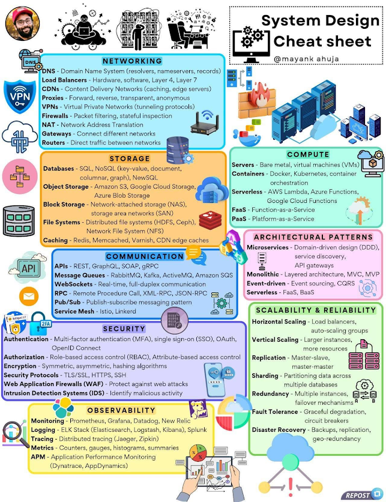

# Cheat Sheet: Thiết kế hệ thống

## 1. Mạng & Kết nối (NETWORKING)
- DNS(Domain Name System): Hệ thống phân giải tên miền (resolvers, nameservers, records)
- Load balancers: Cân bằng tải ở Layer 4, Layer 7 (phần cứng, phần mềm)
- CNDs(Content Delivery Networks): Mạng phân phối nội dung(caching, edge servers)
- Proxies: Proxy chuyển tiếp, proxy ngược, proxy ẩn danh
- VPNs(Virtual Private Networks): Mạng riêng ảo, giao thức đường hầm
- Firewalls: Tường lửa(lọc gói tin, kiểm tra trạng thái)
- NAT (Network Address Translation): Biên dịch địa chỉ mạng
- Gateways: Kết nối các mạng khác nhau
- Routers: Định tuyến lưu lượng giữa các mạng
- Bridge
- VPS
## 2. LƯU TRỮ(STORAGE)
- Databases: SQL, NOSQL(key-value, document, columnar, graph), NewSQL, RxDB
- Object Storage: Amazon S3, Google Cloud Storage, Azure Blod Storage
- Block Storage: NAS(Network-attached storage), SAN(Storage area network)
- File Systems: Hệ thống file phân tán (HDFS, Ceph), NFS (Network File System)
- Caching: Redis, Memcached, Varnish, CND edge caches
## 3. Xử lý (COMPUTE)
- Servers: Máy chủ vật lý (bare metal), máy ảo (VMs)
- Containers: Docker, Kubernates, container orchestration
- Serverless: AWS Lambda, Azure Funtions, Google Cloud Functions
- FaaS(Function-as-a-Service): Dịch vụ serverless dành chức năng nhỏ
- PaaS(Plaform-as-a-Service): Nền tảng điện toán đám mây
## 4. Giao tiếp(COMMUNICATION)
- APIs: REST, GraphQL, SOAP,gRPC
- Message Queues: RabbitMQ, Kafka, ActiveMQ, Amazon SQS
- Websockets: Giao tiếp thơi gian thực, full-duplex
- RPC(Remote Procedure Call): XML-RPC, JSON-RPC
- Pub/Sub(Publish-Subscribe): Mô hình giao tiếp theo kiểu đăng ký và xuất bản
- Service Mesh: Istio, Linkerd(quản lý giao tiếp giữa microservice)
- Webhook
- SSE
## 5. Kiến trúc hệ thống (ARCHITECTURAL PATTERNS)
- Microservices: Thiết kế hướng domain(DDD), service discovery, API gateways
- Monolithic: Kiến trúc nguyên khổi, MVC, MVP
- Event-driven: Event sourcing, CQRS
- Serverless: FaaS, BaaS(Backed-as-a-Service)
## 6. Khả năng mở rộng và độ tin cậy (SCALABILITY & RELIABILITY)
- Horizontal Scaling: Mở rộng theo chiều ngang (thêm máy chủ, auto-scaling)
- Vertical Scaling: Mở rộng theo chiều dọc(nâng cấp tài nguyên máy chủ)
- Replication: Master-slave, master-master
- Sharding: Chia nhỏ dữ liệu để tăng hiệu suất
- Redundancy: Dự phòng nhiều máy chủ, cơ chế failover
- Fault Tolenrance: Cơ chế giảm thiểu lỗi (circuit breakers, graceful degradation)
- Disaster Recovery: Sao lưu, nhân bản, phân tán địa lý
## 7. Bảo mật (SECURITY)
- Authentication: Xác thực (MFA, SSO, OAuth, OpenID Connect)
- Authorization: Phân quyền (RBAC - Role-based access control)
- Encryption : Mã hoá đối xứng, bất đối xứng, băm dữ liệu
- Security Protocols: TLS/SSL, HTTPS, SSH
- Web Application Firewalls: Bảo vệ trước các cuộc tấn công web
- Intrusion Detection Systems: Hệ thống phát hiện xâm nhập
## 8. Quan sát & Giám sát (OBSERVABILITY)
- Monitoring: Giám sát (Prometheus, Grafana, Datadog, New Relic)
- Logging: Ghi log (ELK Stack - Elasticsearch, Logstash, Kibana, Splunk)
- Tracing: Theo dõi truy vết hệ thống (Jaeger, Zipkin)
- Metrics: Chỉ số đo lường (counters, gauges, histograms, summaries)
