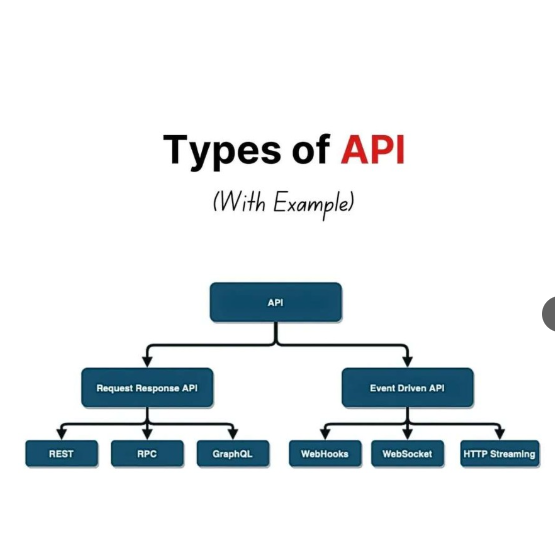
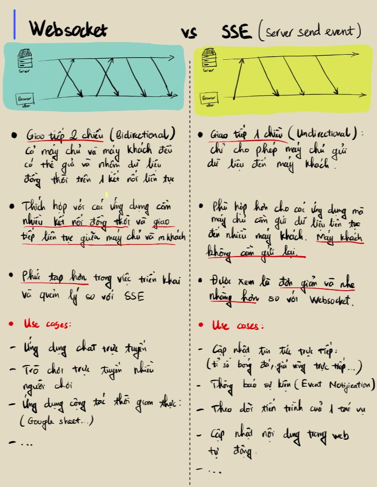
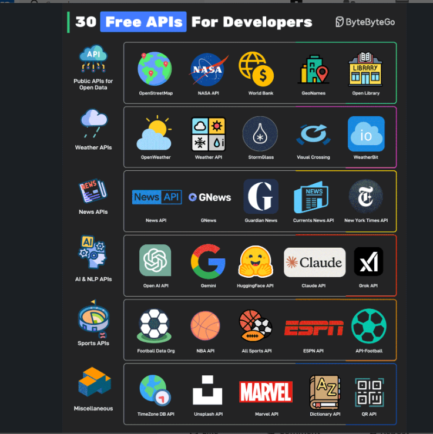
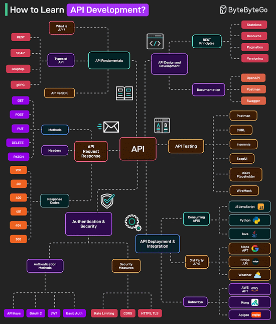
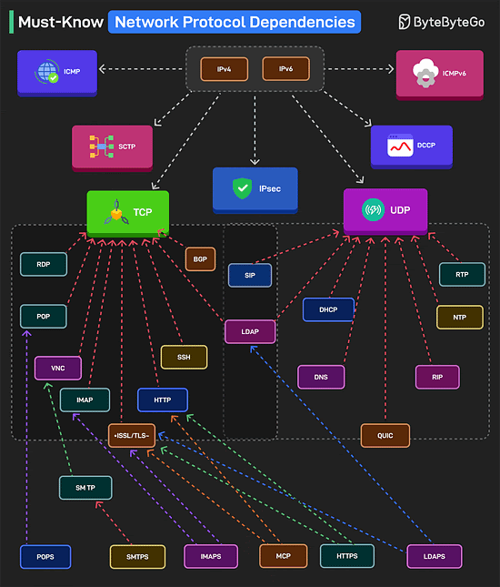
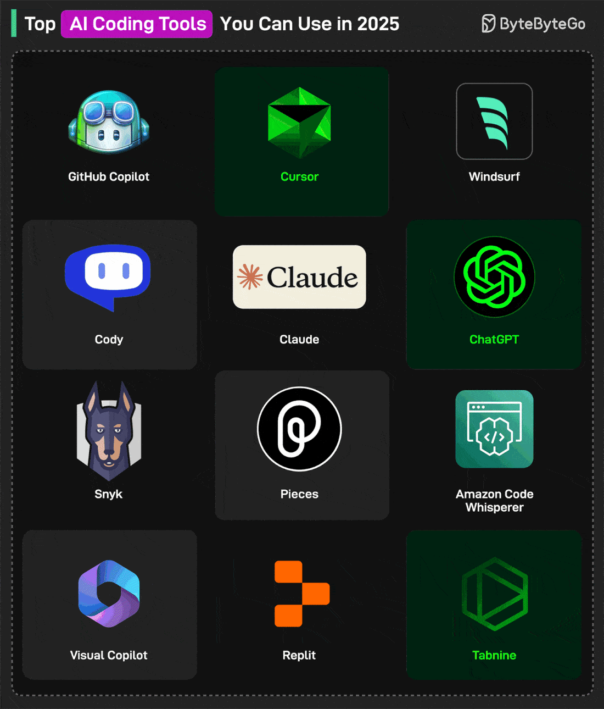
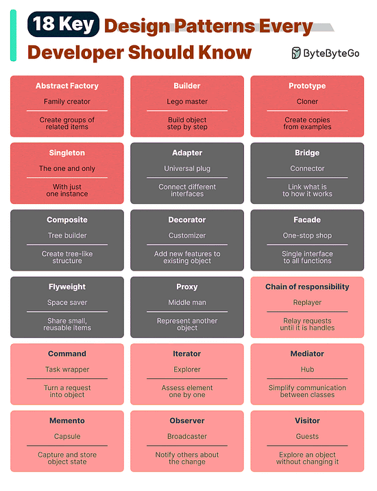

# How to learn API Development 

1. API Fundamentals
What is an API, types of API(REST, SOAP, GraphQL, gRPC, etc..), and API and SDK
2. API Request/Response 
HTTP Methods, Response Codes, and Headers
3. Authentication and Security
Authentication mechanisms(JWT, OAuth2, API Keys, Basic Auth) and security strategies.
4. API Design and Development
Restful API principles include statelessm resource-based URL, versioning, and pagination. Also, API documentation tools like OpenAPI, Postman, Swagger.
5. API Testing
Tools for testing APIs such as Postman, cURl, SoapUI, JMeter and so on.
6. API Development and Integration
Consumig APIs in different languages like JS, Python, and Java. Also, working with 3rd party APIs like the Google Maps API and the Stripe API. Learn about API Gateways like Aws, Kong, Apigee.
# Must-Know Network Protocal Dependencies
Understanding network protocol dependencies is essential for cybersecurity and networking. Here's a quick understanding of the same:

1. IPv4 and IPv6 are the foundation of all networking. ICMP and ICMPv6 handle diagnostics, while IPsec ensure secure communication.
2. TCP and UDP support various protocols. SCTP and DCCP serve specific cases.
3. SOme TCP-based protocols are HTTP, SSH, BGP, RDP, IMAP, SMTP, POP, etc.
4. UDP-based protocols are DNS, DHCP, SIP, RTP, NTP, etc.
5. SSL/TLS encrypts HTTPS, IMAPSM, and SMTPS.
6. LDAP and LDAPs are used for directory services over TCP and secured with SSL/TLS.
7. QUIC is a UDP-based replacement for TCP+TLS for faster, encrypted connnections.
8 MCP or Model Context Protocol is an emerging standard for communicating with LLMs
# Top AI Coding Tools for Developers You Can Use in 2025

# 18 Key Design Patterns Every Developer Should Know
