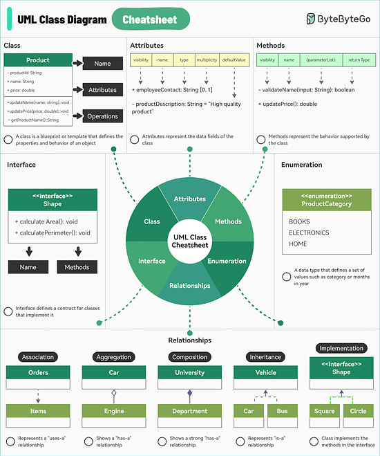
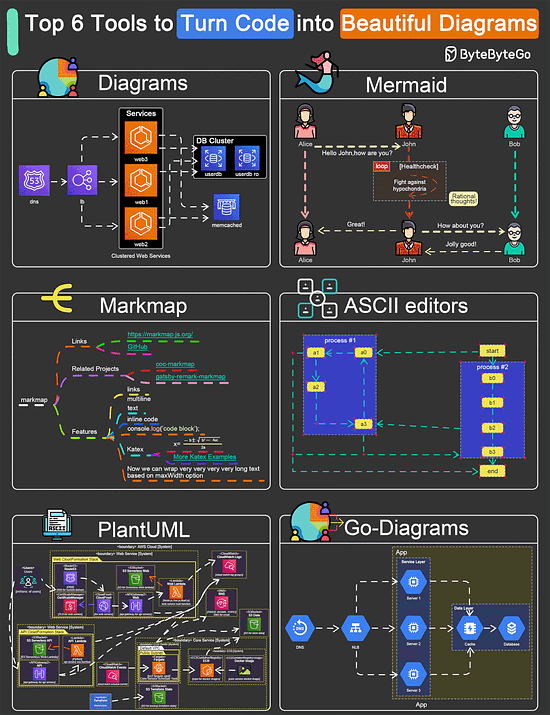

# 20 Popular Open source projects started or Supported by Big Companies
1. Google
- Kubernetes
- Tensorflow
- Go
- Angular
2. Meta
- React
- PyTorch
- GraphQL
- Cassandra
3. Microsoft
- VSCode
- TypeScript
- Playwright
4. Netflix
- Chaos Monkey
- Hystrix
- Zuul
5. LinkedIn
- Kafka
- Samza
- Pinot
6. RedHat
- Ansible
- OpenShift
- Ceph Storage
# A Cheatsheet for UML Class Diagrams
UML is standard way to visualize the design of your system and class diagrams are used across the industry.

They consist of:
1. Class
Acts as the blueprint that defines the properties and behavior of an object.
2. Attributes
Attributes in a UML class diagram represent the data fields of the class.
3. Methods
Methods in a UML class diagram represent the behavior that a class can perform.
4. Interfaces
Defines a contract for classes that implement it. Includes a set of methods that the implementing classess must provides.
5. Enumerations
A special data type that defines a set of named values such as product category of months in a year.
6. Relationships
Determines how one class is related to another. Some common relationships are as follows:
- Association
- Aggregation
- Composition
- Inheritance
- Implementation
# Top 6 tools to turn code into beautiful diagrams
