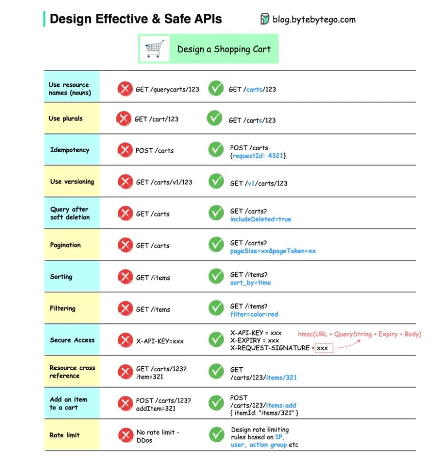
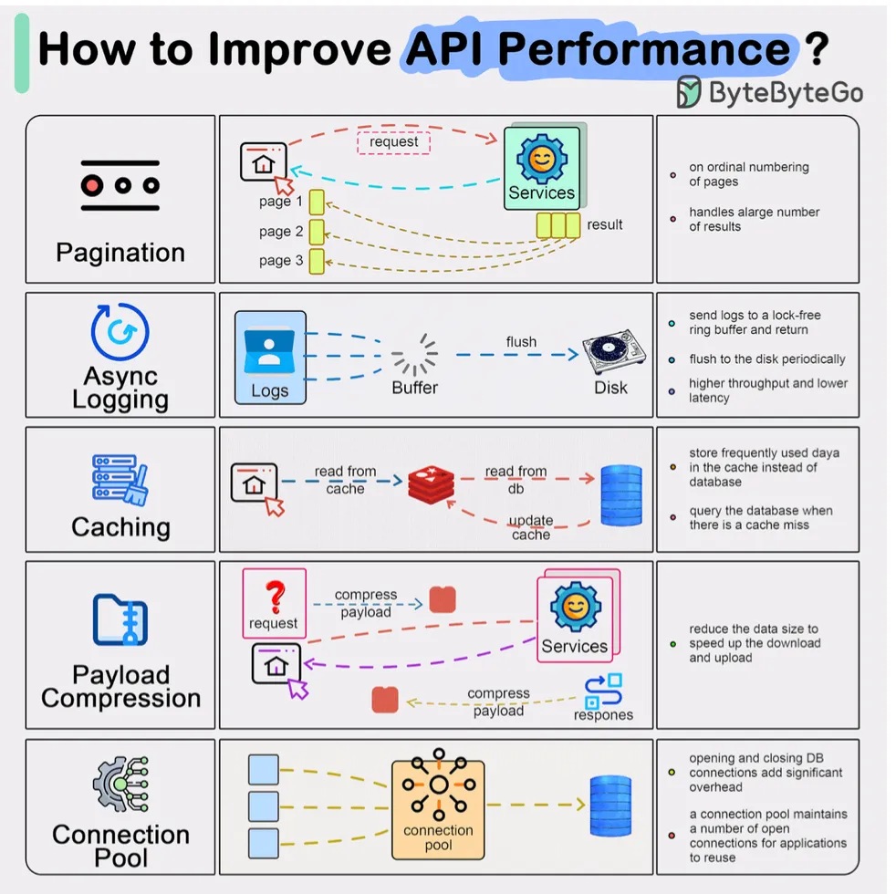
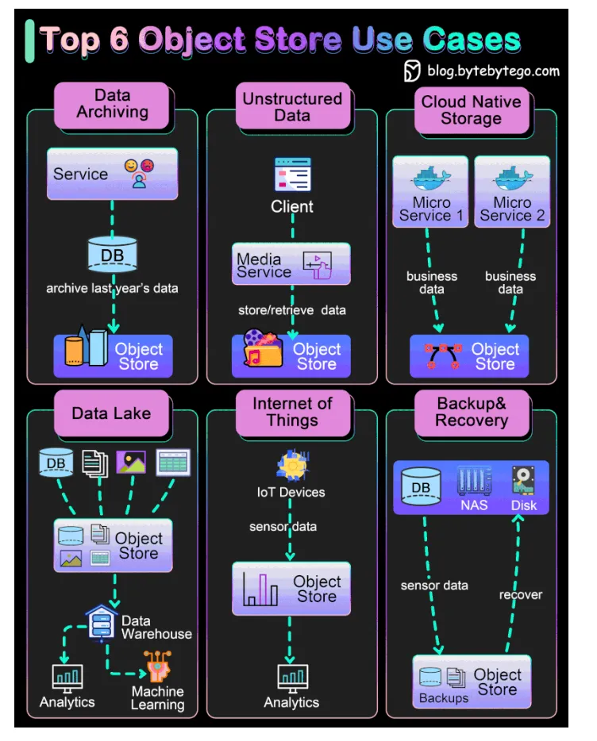

# System Design CheatSheet for Interview

## Rest API

## Network

## Server

## AWS Networking cheatsheet

## OAuth & JWT

## Session vs Cookies

Cookies and sessions are both used to carry user information over HTTP requests, including user login status, user permissions, etc.
1. Cookies
Cookies typically have size limits (4KB). They carry small pieces of information and are stored on the users’ devices. Cookies are sent with each subsequent user request. Users can choose to ban cookies in their browsers.
2. Sessions
Unlike cookies, sessions are created and stored on the server side. There is usually a unique session ID generated on the server, which is attached to a specific user session. This session ID is returned to the client side in a cookie. Sessions can hold larger amounts of data. Since the session data is not directly accessed by the client, the session offers more security.

## CI/CD WorkFlow

## Kafka Internal working & Usecase

## Database

## Software Architecture

## System design Acronyms

## Data Pipeline Overview

## System Testing

## Git Working

To begin with, it’s essential to identify where our code is stored. The common assumption is that there are only two locations — one on a remote server like Github and the other on our local machine. However, this isn’t entirely accurate. Git maintains three local storages on our machine, which means that our code can be found in four places:
 
- Working directory: where we edit files
- Staging area: a temporary location where files are kept for the next commit
- Local repository: contains the code that has been committed
- Remote repository: the remote server that stores the code

## Code Review and Ship to Production

## Docker , Kubernetes

In a traditional software development, code, build, test, release and monitoring are siloed functions. Each stage works independently and hands over to the next stage.

DevOps, on the other hand, encourages continuous development and collaboration between developers and operations. This shortens the overall life cycle and provides continuous software delivery.

NoOps is a newer concept with the development of serverless computing. Since we can architect the system using FaaS (Function-as-a-Service) and BaaS (Backend-as-a-Service), the cloud service providers can take care of most operations tasks. The developers can focus on feature development and automate operations tasks.

NoOps is a pragmatic and effective methodology for startups or smaller-scale applications, which moves shortens the SDLC even more than DevOps.

## Https Working

## API Gateway

## Microservices

## URL vs URI vs URN

## Design Patterns

## Logging and Tracing

## Routing policies

## Load Balancing

Static Algorithms

Round robin
The client requests are sent to different service instances in sequential order. The services are usually required to be stateless.
Sticky round-robin
This is an improvement of the round-robin algorithm. If Alice’s first request goes to service A, the following requests go to service A as well.
Weighted round-robin
The admin can specify the weight for each service. The ones with a higher weight handle more requests than others.

Hash
This algorithm applies a hash function on the incoming requests’ IP or URL. The requests are routed to relevant instances based on the hash function result.

Dynamic Algorithms

Least connections
A new request is sent to the service instance with the least concurrent connections.
Least response time
A new request is sent to the service instance with the fastest response time.
## Encryption

## Message Queue
 

## Object Storage

## API vs SDK

## Forward vs Reverse Proxy

## Caching
 
## Cloud Native
 

## Event Sourcing

## Firewall

## Distributed system

## Batch vs Stream Processing

## CDN — Content Delivery Network

