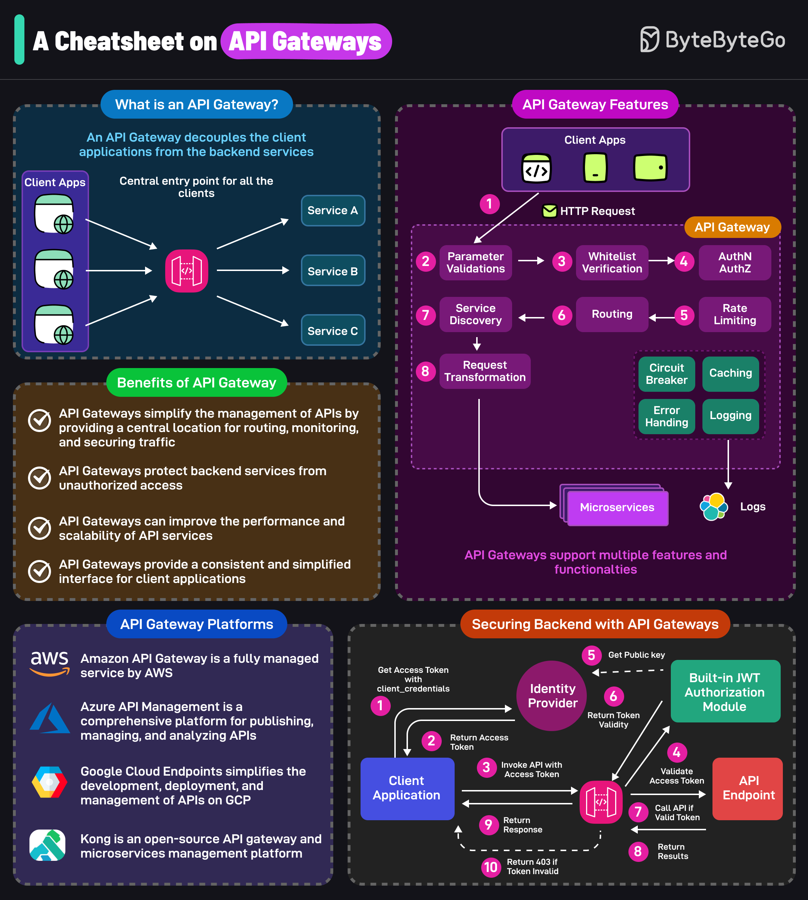

# API Gateway
API Gateway are essential components in modern software architectures particularly microservices-based systems.
 
They act as a single entry point for all API requests, providing a unified interface for accessing various services and data. By decoupling(tách rời) client applications from backend microservices, API Gateways simplify API management and enhance the overall performance and security of the system.
 
API Gateways help enhance the developer experience while building scalable and maintainable systems. Organizations can achieve(đạt được) better control over their API landscape by using API Gateways.
 
As the complexity of software systems continues to grow, API Gateways will play an increasingly important role in enabling effective communication and integration between services and clients.
 
In this post, we'll explore the various aspects of API Gateways in detail.

