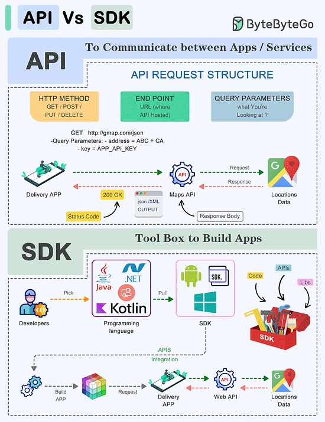
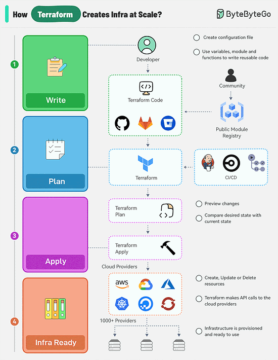

# API vs SDK

API(Application Programming Interface) and SDK(Software Development Kit) are esssential tools in the software development world, but they serve distinct purposes:
1. API: An API is a set of rules and protocols that allows different software applications and services to communicate with each other.
- It defines how software components should interact.
- Facilitates data exchange and functionality access between software components.
- Type consists of endpoints, requests, and responses.
2. SDK: An SDK is a comprehensive package of tools, libraries, sample code, and documentation that assists developers in building applications for a particular platform, framework, or hardware.
- Offers higher-level abstractions, simplifing development for a specific platform.
- Tailored to specific platforms or framworks, ensuring compatibility and optimal performance on that platform.
- Offer access to advanced features and capabilities specific to the platform, which might be otherwise challenging to implement from scratch.
# How does Terraform turn Code into Cloud

There are multiple stages in a Terraform workflow:
1. Write Infrastructure as Code
Define resources, provides, and configurations in Terraform configurations files.
Use variables, modules, and functions to make the code reusable and maintainable.
Integrate with Terraform community registries for ready-to-use modules.
2. Terraform Plan 
Preview the changes Terraform will make to the infrastrucutre by running "terraform plan". It can be triggered as part of a CI/CD pipeline.
Terraform compares the desired state defined in the configuration file with the current state in the state file.
3. Terraform Apply
Run "terraform apply" to create, update, or delete resources based on the plan.
Terraform make API calls to the specified provides(AWS, Azure, GCP, Kubernates, etc) to providion the resources.
The state file is updated to reflect the new state of the infrastructure.
4. Infrastructure Ready
Terraform state file acts as a single source of truth for the current state of the infrastructure.
State file enables version control and collaboration between team members for future changes.
