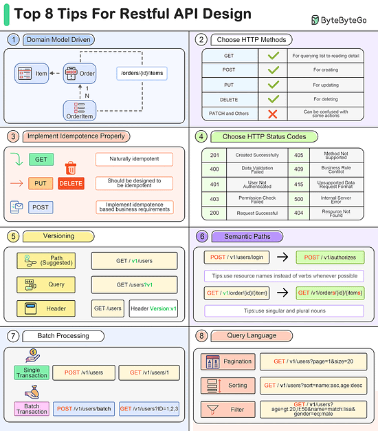

# Top 8 tips for restful API Design

1. Domain Model Driven
When designing the path structure of a RESTful API, we can refer to the domain model.
2. Choose proper HTTP Methods
Defining a few basic HTTP methods can simplify the API design. For example, Patch can often be a problem for teams
3. Implement Idempotence Properly
Designing for idempotence in advance can improve the robustness of an API. GET method is idempotent, but POST needs to be designed properly to be idempotent.
4. Choose Proper HTTP Status Codes
Define a limited number of HTTP status codes to use to simplify application development.
5. Versioning
Design the version number for the API in advance can simplify upgrade work.
6. Semantic Paths
Using semantic paths makes APIs easier to understand, so that users can find the correct APIs in the documentation.
7. Batch Processing
Use batch/bulk as a keyword and place it at the end of the path.
8. Query Language
Designing a set of query rules makes the API more flexible. For example, pagination, sorting, filtering etc.