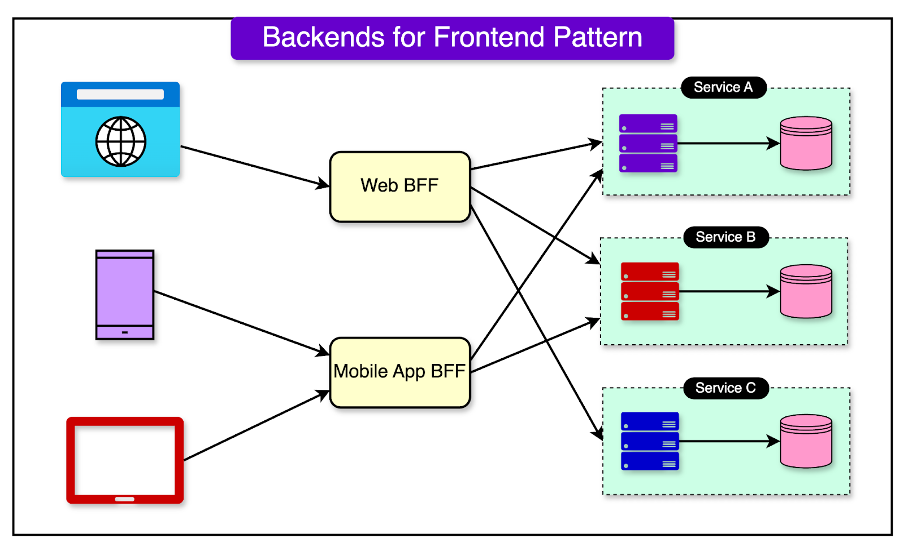
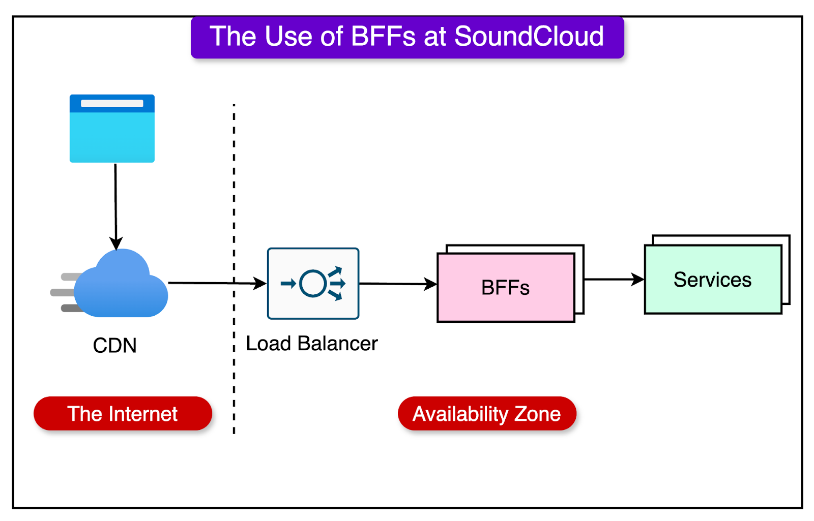
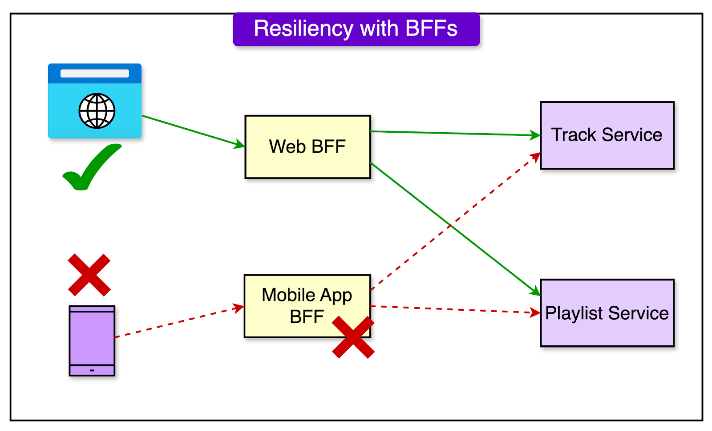
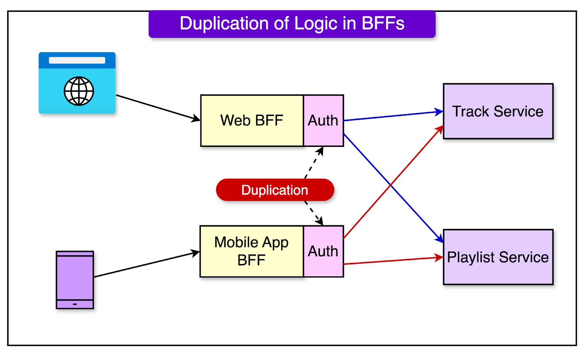
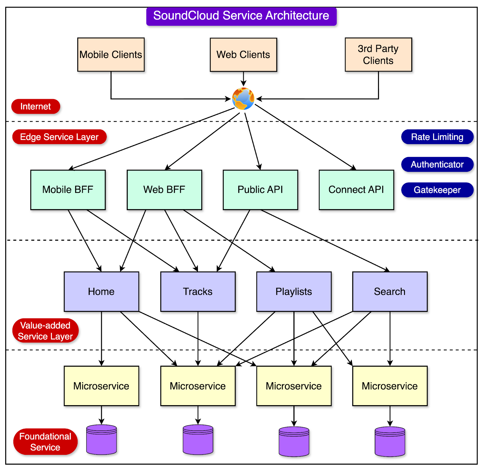
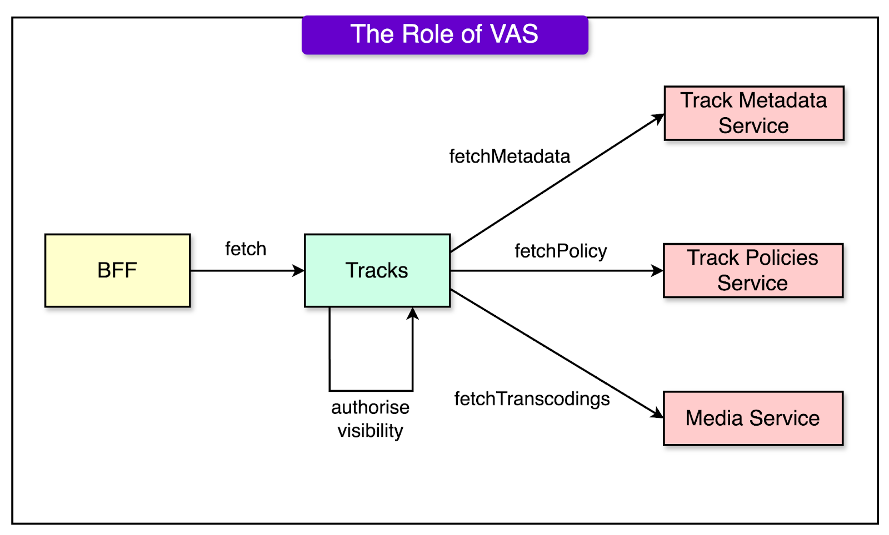
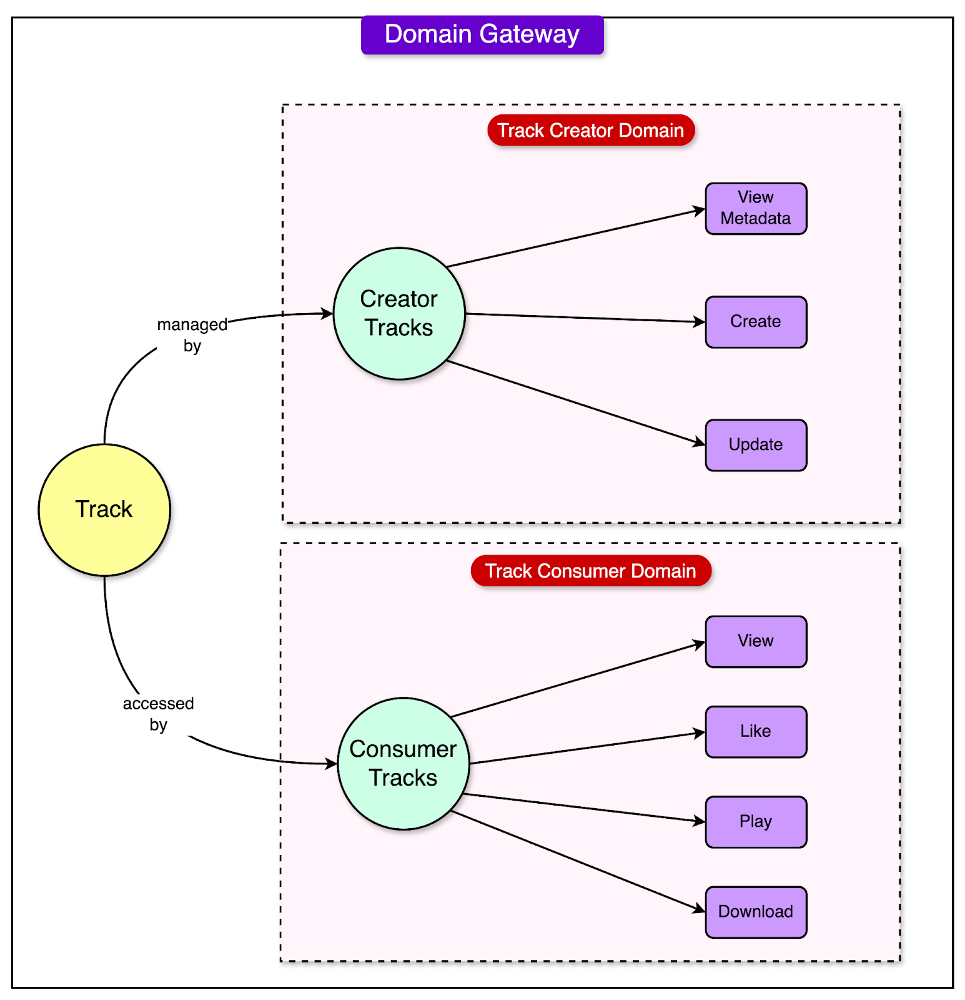

# BFFs at SoundCloud
The term BFF stands for Backends for Frontends. In simpler terms, thinks of a BFF as a dedicated API gateway for each device or interface type interacting with your application.
 
The diagram below shows a high-level view of BFF.

The SoundCloud engineering team operates dozens of BFFs, each serving a specific type of client. For example, a BFF named Mobile API serves Android and iOS clients. Next, there is a Web API BFF that handles the web front end and the widgets. Also, there are dedicated BFFs for public and partner APIs.
 
All external traffic coming into SoundCloud passes through one of the BFFs. Also, these BFFs handle multiple functionalities such as:
- Rate Limiting
- Authentication
- Header Sanitization
- Cache-Control

To facilitate the sharing of common logic across all the BFFs, all of them make use of an internal library that provides edge capabilities. Any changes to this library are rolled out automatically within hours.
SoundCloud follows the inner source model development philosophy for these BFFs. 
According to this philosophy, individual teams can contribute to the BFF code base, and a core team reviews every change based on the principles discussed in the Collective. This Collective, organized by a Platform Lead, meets regularly to discuss issues and share knowledge.
## Advantages of BFF
BFFs provide multiple advantages. Let us look at a few major ones.
1. Autonomy
Autonomy is perhaps the biggest value addition in using a BFF.
 
Separate APIs per client type means that we can optimize the API for whatever is the most convenient for a particular client type.
 
For example, in the case of SoundCloud, the mobile clients preferred larger responses with a higher number of embedded entities as a way to minimize the number of requests, In contrast, the web front end prefers fine-grained responses.
 
BFFs take care of these varying demamds for each client type.
2. Resilience and Lower Risk
BFFS also reduce the overall risk of the application going down
 
While a bad deployment might bring down an entire BFF in an availability zone, it doesn't bring down the entire platform, which was a possibility with the monilithic API approach.
 
See the diagram below that represents a scenario where the mobile BFF going down does not mean the Web BFF is also down.

3. High Development Speed
Autonomy and resilience work together to improve confidence, resulting in a higher development speed for new features.
 
At SoundCloud, the main BFFs are deployed multiple times a day due to contributions from all over the engineering division.

## Disadvantages
All decisions in software development come with a set of trade-offs. The same is the case with using BFFs. 
1. Complexity
When the microservices powering the BFFs are very small, performing only CRUD operations with no business logic, the feature integration ends up in the BFF layer. In other words, the entire business logic goes into the BFF layer.
 
Moreover, there is a prevalent idea that the BFF is just an extension of the client and should be treated as the backend side of the client. 
 
While the sentiment is justified due to the naming, it results in developers pushing complex client-side logic to BFF. For example, pushing functionalities like pagination to the server.
2. Duplication of Code
While centralized API gateways also have a problem when business logic ends up getting migrated to the gateway, BFFs also suffer from duplication.
 
Business logic is duplicated across multiple BFFs. Over time, this duplication can diverge, resulting in inconsistent implementations that drift apart as more development happens.
 
For example, SoundCloud saw this issue with the authorization logic getting duplicated across multiple BFFs. This was because the authorization logic needed data from both Track and Playlist entities handled by different microservices and therefore, the integration logic had to be moved into the BFFs.

3. Proliferation of BFFs

Even too many BFFs can be a bad thing. 
 
While BFFs provide autonomy, they also introduce operational overhead. If the team starts to create BFFs for every minor use case, suddenly there is a lot of maintenance overhead.
 
Moreover, full autonomy is an illusion. BFFs are an intersection of two worlds and a strong collaboration is still needed between the frontend and backend engineers to build the right BFFs.

4. Value-Added Services
At SoundCloud, the BFF implementations became problematic over time due to multiple reasons:
- Increased complexity
- Increased duplicate of code
- Divergent authorization and business logic across BFFs
This divergence was especially dangerous because the maintenance and synchronicity of the authorization logic are critical for a secure system.
 
These challenges led to modifications in the overall architecture of SoundCloud’s backend. 

There were three major parts to this architecture:
- Edge Services: Provides API gateway capabilities. This is essentially the place where the BFFs live.
- Value-Added Services: Services in this layer consume data from other services and process them in some way to build better experiences for the user. More on them in a bit.
- Foundational Services: These are the low-level microservices that act as the building blocks of the application.
## Responsibility of VAS
The Value-Added Services or VAS, built on the concepts of Domain-Driven Design (DDD) form the centrepoint of this new architecture. Specifically, DDD has four major concepts that are as follows:
- Domain: A user or business concern that forms a boundary around service integrations.
- Entity: An object that has an independent identifier and lifecycle.
- Value Objects: Metadata related to a given entity
- Aggregates: Collection of one or more related entities.
In the context of SoundCloud, the Value-Added Services sit between the BFFs and downstream foundational services, and synthesize the aggregates for the BFF. Their main responsibility is to serve core aggregates like Track and Playlist. Also, the VAS handled all context-specific logic related to track visibility and authorization rules.
 
For example, the Track VAS filters out all geo-blocked tracks in certain territories.
 
See the diagram below for reference:

With this approach, BFFs no longer made calls to the individual microservices. The main advantage of this was that all the shared code now lived in a singular codebase and there was no need to duplicate calls to foundational services in multiple BFFs.

## VAS Migration Process
To migrate the logic from the BFFs to VAS, the SoundCloud engineering team employed a 3-step process. 
 
For example, here’s how this process was used to create a dedicated VAS for handling Playlists:
- First, logic was extracted from the BFFs to create a new Playlist VAS. This required analysis, investigation, and documentation.
- Second, automatic tests were written to ensure that centralized logic matched the refactored services. Integration tests were added to verify the response format.
- Lastly, around 50 playlist endpoints in the BFFs were migrated to use the Playlist VAS. Responses from both were carefully compared to ensure a healthy migration.

## Challenges of VAS
Despite their great utility, VAS also posed a couple of challenges:
- VAS suffered from a big fan out of calls to multiple services. With more features, the aggregates grew and so did the number of network calls to the foundational services, resulting in a big challenge around the size of the fanout.
- BFFs often have different needs based on their application. For example, one track feature might only be needed on mobile, which makes it pointless to fetch the entire track aggregate from the Web API where that feature may not be needed.
There was a need for centralized VAS endpoints to serve customized aggregates based on the specific needs of the BFF.
 
This was supported by the partial response feature in which API consumers can specify which part of the response they will consume using a FieldMask in the request

## Domain Gateways
The major recent evolution in SoundCloud’s service architecture came with the introduction of Domain Gateways. 
 
This was needed because SoundCloud not only provides a consumer application to a music catalog but also provides tools for creators to upload and distribute their music.
 
In other words, Consumer and Creator are different domains and are owned by different teams. Implementing the concerns of both domains in a single VAS worked well for a time, but eventually created a large amount of coupling and complexity, resulting in decreased development speed.
 
To mitigate this, the SoundCloud engineering team introduced the concept of a Domain Gateway.
 
At its core, Domain Gateway is an implementation of a VAS to a specific business domain. See the diagram below to get a better idea:

In this approach, the SoundCloud engineering team identified the different business domains that need to use a given entity or aggregate and created a Domain Gateway for each domain. Each gateway can then be maintained by different teams and represent different views on a given entity while relying on the same foundational microservices.
 
You can also think of the Domain Gateway as a facade that provides stability and acts as an anti-corruption layer. 
 
It trades off a certain level of duplication in exchange for autonomy and increased scalability. However, it’s suitable when different domains have significantly different access patterns and feature sets.