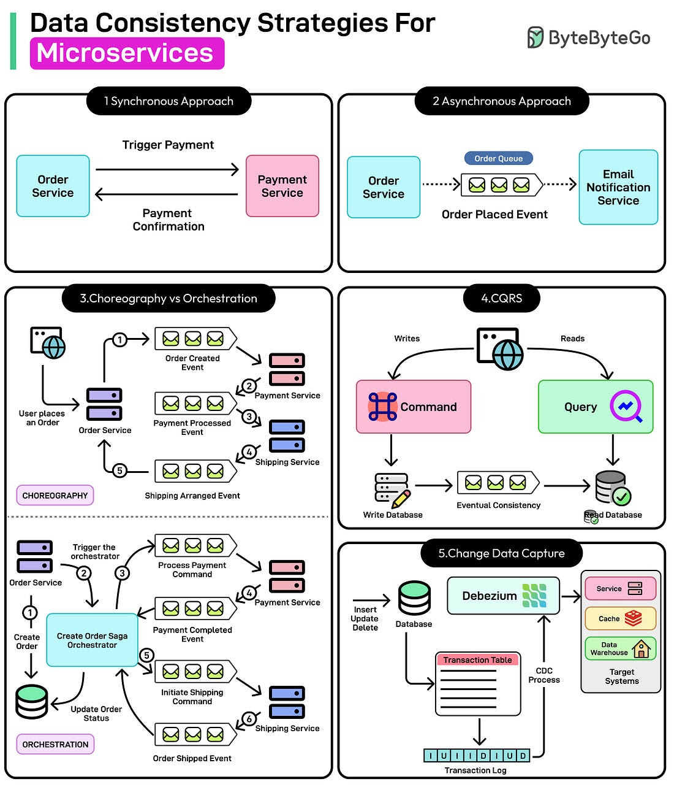
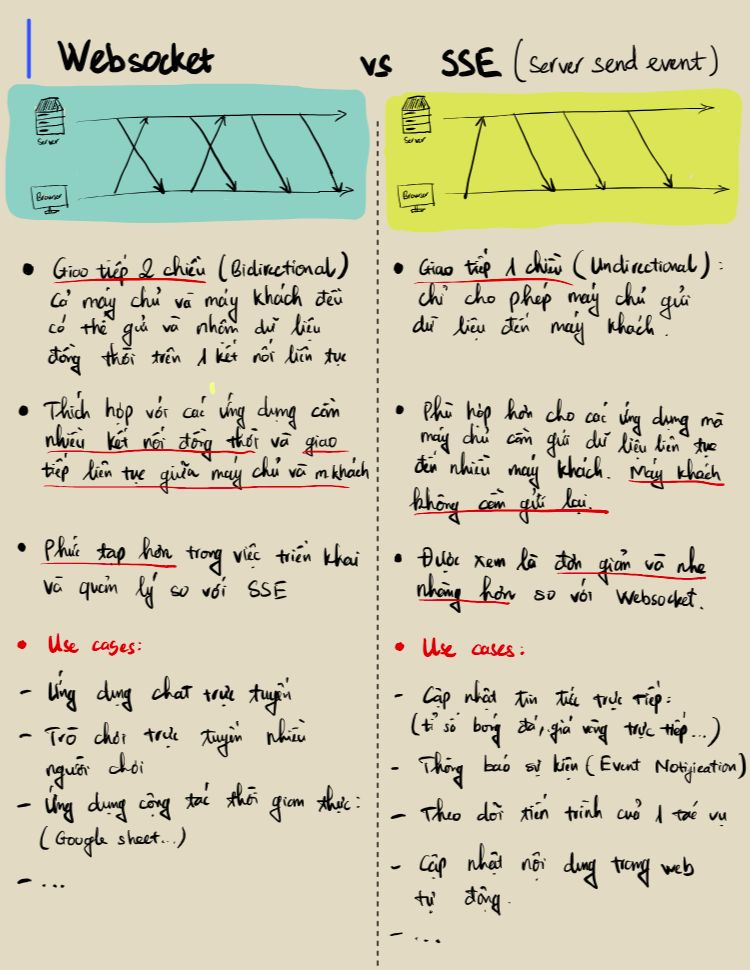
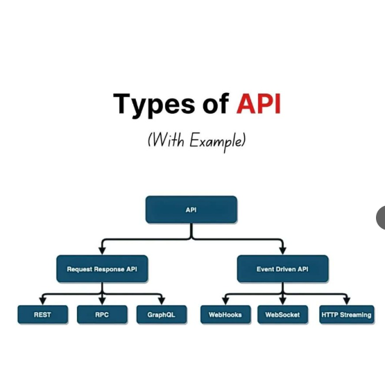

# Mastering Data Consistency Across Microservices
Microservices architecture is a software design pattern where an application is built as a collection of small, independent services, each responsible for a specific function.
These services communicate with each other using APIs (Application Programming Interface) and operate independently, allowing for greater flexibility, scalability, and ease of maintenance. Think of a food delivery app with the following services:
-   The order service manages customer orders.
- The payment service handles transactions
- The restaurant service update menu availability
- The delivery service assigns and tracks deliveries.
Each service operates independently, allowing teams to update or scale them separately.

However, due to this separation, a major challenge with microservices is maintaining data consistency. In a monolithic system, all functionalities share a single database, resulting in consistent updates. On the other hand, microservices architecture advocates that each service should manage its database. While this is a good practice, it can lead to some scenarios such as:
- Duplicate or Lost Data
- Network Delays
- Concurrency Issues

Understanding these scenarios is key to building robust, scalable applications using microservices. In this artile, we will understand how data consistency can arise in a microservices architecture and various strategies to deal with it.

