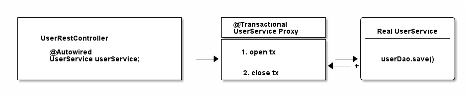
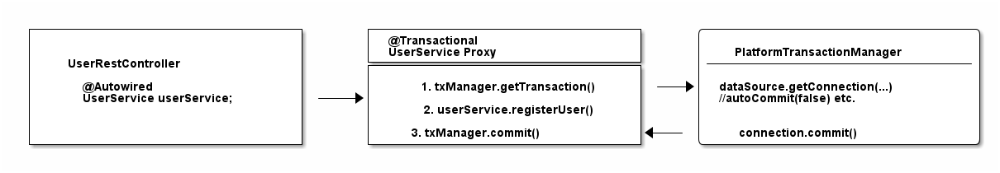
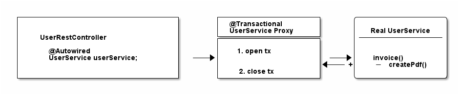

# Transaction in Spring
## Introduction
Transactions are used to ensure data integrity and consistency in applications that interact with databases or other transactional resources. Spring provides comprehensive support for declarative transaction management, allowing you to manage transaction using annotations or XML configuration.
1. Declarative Transaction Management
Spring allows you to manage transaction declaratively using annotations(`@Transactional`) or XML configuration. Declarative transaction management provides a high-level abstraction, allowing you to specify transaction behaviour at the method or class level without writing low-level transaction management code.
2. Programmatic Transaction Management
Spring also supports programmatic transaction management, where you can manage transaction programmatically using `TransactionTemplate` or `PlatformTransactionManager`. This approach is more flexible and allows for finer-grained control over transactional behaviour, but it requires writing more code compared to declarative transaction management
3. Transaction Propagation:
Spring provides different propagation behaviors for transactions, allowing you to control how transactions are propagated when methods are invoked within a transaction context. Propagation behaviors include `REQUIRED`, `REQUIRED_NEW`, `NESTED`,`SUPPORTS`,`MANDATORY`,`NOT_SUPPORTED`, and `NEVER`.
4. Isolation Levels:
Spring supports different transaction isolation levels, which define the degree of isolation between concurrent transactions, Isolation levels include `DEFAULT`, `READ_UNCOMMITTED`,`READ_COMMITTED`,`REPEATABLE_READ`, `SERIALIZABLE`.
5. Transaction Attributes:
Transaction methods can have various attributes, such as `readOnly`, `timeout`, and `rollbackFor`, which allow you to customize transaction behavior based on specific requirements.
6. Transaction Managers:
Spring provides various implementations of `PlatformTransactionManager` for different transaction resources, such as `DataSourceTransactionManager` for JDBC-based transactions, `JpaTransactionManager` for JPA-based transactions, and `JtaTransactionManager` for JTA-based transactions.
7. Transaction Interceptors:
Spring uses AOP (Aspect - Oriented Programming) to intercept method invocations and apply transactional behavior dynamically. Transaction aspects automatically begin, commit, or rollback transactions based on the configuration provided.
8. Exception Handling:
Spring's transaction management automatically rolls back transactions when unchecked exception (`RuntimeException` and its subclasses) are thrown from transaction methods. You can customize exception handling behavior using attributes like `rollbackFor` and `noRollbackFor`.
## Deep into 
### 1. How plain JDBC Transaction Management works?
```java
import java.sql.Connection;

Connection connection = dataSource.getConnection(); // (1)

try (connection) {
    connection.setAutoCommit(false); // (2)
    // execute some SQL statements...
    connection.commit(); // (3)

} catch (SQLException e) {
    connection.rollback(); // (4)
}
```
1. (1) You need a connection to the databased to start transactions.
2. (2) setAutoCommit(true) makes sure that every single SQL statement automatically gets wrapped in its own transaction. and setAutoCommit(false) is the opposite
3. (3) commit our transaction
4. (4) rollback our changes, if there was an exception.
### 2. How to use JDBC isolation levels and savepoints
If using Spring's @Transactional annatation 
```java
@Transactional(propagation=TransactionDefinition.NESTED,
               isolation=TransactionDefinition.ISOLATION_READ_UNCOMMITTED)
```
We will conver nested Spring transactions and isolation levels later in more detail, but again it helps to know that these parameters all boil down to the following, basic JDBC code:
```java
import java.sql.Connection;

// isolation=TransactionDefinition.ISOLATION_READ_UNCOMMITTED

connection.setTransactionIsolation(Connection.TRANSACTION_READ_UNCOMMITTED); // (1)

// propagation=TransactionDefinition.NESTED

Savepoint savePoint = connection.setSavepoint(); // (2)
...
connection.rollback(savePoint);
```
1. (1) This how Spring set isolation levels on a database connection
2. (2) Nested transaction in Spring are just JDBC/database savepoints. https://docs.oracle.com/javase/tutorial/jdbc/basics/transactions.html
### 3. How Spring’s or Spring Boot’s Transaction Management works
1. How to use Spring’s Programmatic Transaction Management?
The first, but rather sparingly used way to define transactions in Spring is programmatically: Either through a TransactionTemplate or directly through the PlatformTransactionManager. Code-wise, it looks like this:
```java
@Service
public class UserService {

    @Autowired
    private TransactionTemplate template;

    public Long registerUser(User user) {
        Long id = template.execute(status ->  {
            // execute some SQL that e.g.
            // inserts the user into the db and returns the autogenerated id
            return id;
        });
    }
}
```
- You do not have to mess with opening or closing database connections yourself (try-finally)
- You also do not have to catch SQLExceptions, as Spring converts these exceptions to runtime exceptions for you.
- And you have better integration into the Spring ecosystem. TransactionTemplate will use a TransactionManager internally, which will use a data source. All are beans that you have to specify in your Spring context configuration, but then don’t have to worry about anymore later on.
### 4. How to use Spring’s XML Declarative Transaction Management?
Back in the day, when XML configuration was the norm for Spring projects, you could configure transactions directly in XML. Apart from a couple of legacy, enterprise projects, you won’t find this approach anymore in the wild, as it has been superseded with the much simpler @Transactional annotation.
We will not go into detail on XML configuration in this guide, but you can use this example as a starting point to dive deeper into it
```xml
<!-- the transactional advice (what 'happens'; see the <aop:advisor/> bean below) -->
    <tx:advice id="txAdvice" transaction-manager="txManager">
        <!-- the transactional semantics... -->
        <tx:attributes>
            <!-- all methods starting with 'get' are read-only -->
            <tx:method name="get*" read-only="true"/>
            <!-- other methods use the default transaction settings (see below) -->
            <tx:method name="*"/>
        </tx:attributes>
    </tx:advice>
```
You are specifying an AOP advice (Aspect Oriented Programming) with the above XML block, that you can then apply to your UserService bean like so:
```xml
<aop:config>
    <aop:pointcut id="userServiceOperation" expression="execution(* x.y.service.UserService.*(..))"/>
    <aop:advisor advice-ref="txAdvice" pointcut-ref="userServiceOperation"/>
</aop:config>

<bean id="userService" class="x.y.service.UserService"/>
```
Your UserService bean would then look like this:
```java
public class UserService {

    public Long registerUser(User user) {
        // execute some SQL that e.g.
        // inserts the user into the db and retrieves the autogenerated id
        return id;
    }
}
```
### 5. How to use Spring’s @Transactional annotation ( Declarative Transaction Management )
Now let’s have a look at what modern Spring transaction management usually looks like:
```java
public class UserService {

    @Transactional
    public Long registerUser(User user) {
       // execute some SQL that e.g.
        // inserts the user into the db and retrieves the autogenerated id
        // userDao.save(user);
        return id;
    }
}
```
How is this possible? There is no more XML configuration and there’s also no other code needed. Instead, you now need to do two things:
- Make sure that your Spring Configuration is annotated with the @EnableTransactionManagement annotation (In Spring Boot this will be done automatically for you).
- Make sure you specify a transaction manager in your Spring Configuration (this you need to do anyway).
- And then Spring is smart enough to transparently handle transactions for you: Any bean’s public method you annotate with the @Transactional annotation, will execute inside a database transaction
So, to get the @Transactional annotation working, all you need to do is this:
```java
@Configuration
@EnableTransactionManagement
public class MySpringConfig {

    @Bean
    public PlatformTransactionManager txManager() {
        return yourTxManager; // more on that later
    }

}
```
### 6. CGlib & JDK Proxies - @Transactional under the covers

- Opening and closing database connections/transactions.

- And then delegating to the real UserService, the one you wrote.

- And other beans, like your UserRestController will never know that they are talking to a proxy, and not the real thing.
1. For what do you need a Transaction Manager (like PlatformTransactionManager)?
```java
@Bean
public DataSource dataSource() {
    return new MysqlDataSource(); // (1)
}

@Bean
public PlatformTransactionManager txManager() {
    return new DataSourceTransactionManager(dataSource()); // (2)
}
```
- You create a database-specific or connection-pool specific datasource here. MySQL is being used for this example.
- Here, you create your transaction manager, which needs a data source to be able to manage transactions.
Simple as. All transaction managers then have methods like "doBegin" (for starting a transaction) or "doCommit", which look like this - taken straight from Spring’s source code and simplified a bit:
```java
public class DataSourceTransactionManager implements PlatformTransactionManager {

    @Override
    protected void doBegin(Object transaction, TransactionDefinition definition) {
        Connection newCon = obtainDataSource().getConnection();
        // ...
        con.setAutoCommit(false);
        // yes, that's it!
    }

    @Override
    protected void doCommit(DefaultTransactionStatus status) {
        // ...
        Connection connection = status.getTransaction().getConnectionHolder().getConnection();
        try {
            con.commit();
        } catch (SQLException ex) {
            throw new TransactionSystemException("Could not commit JDBC transaction", ex);
        }
    }
}
```
So, the datasource transaction manager uses exactly the same code that you saw in the JDBC section, when managing transactions.
With this in mind, let’s extend our picture from above:

To sum things up:
- If Spring detects the @Transactional annotation on a bean, it creates a dynamic proxy of that bean.
- The proxy has access to a transaction manager and will ask it to open and close transactions / connections.
- The transaction manager itself will simply do what you did in the plain Java section: Manage a good, old JDBC connection.
2. What is the difference between physical and logical transactions?
Imagine the following two transactional classes.
```java
@Service
public class UserService {

    @Autowired
    private InvoiceService invoiceService;

    @Transactional
    public void invoice() {
        invoiceService.createPdf();
        // send invoice as email, etc.
    }
}

@Service
public class InvoiceService {

    @Transactional
    public void createPdf() {
        // ...
    }
}
```
UserService has a transactional invoice() method. Which calls another transactional method, createPdf() on the InvoiceService.
Now in terms of database transactions, this should really just be one database transaction. (Remember: getConnection(). setAutocommit(false). commit().) Spring calls this physical transaction, even though this might sound a bit confusing at first.
From Spring’s side however, there’s two logical transactions happening: First in UserService, the other one in InvoiceService. Spring has to be smart enough to know that both @Transactional methods, should use the same underlying, physical database transaction.
How would things be different, with the following change to InvoiceService?
```java
@Service
public class InvoiceService {

    @Transactional(propagation = Propagation.REQUIRES_NEW)
    public void createPdf() {
        // ...
    }
}
```
Changing the propagation mode to requires_new is telling Spring that createPDF() needs to execute in its own transaction, independent of any other, already existing transaction. Thinking back to the plain Java section of this guide, did you see a way to "split" a transaction in half? Neither did I.
Which basically means your code will open two (physical) connections/transactions to the database. (Again: getConnection() x2. setAutocommit(false) x2. commit() x2) Spring now has to be smart enough that the two logical transactional pieces (invoice()/createPdf()) now also map to two different, physical database transactions.
So, to sum things up:
- Physical Transactions: Are your actual JDBC transactions.
- Logical Transactions: Are the (potentially nested) @Transactional-annotated (Spring) methods.
This leads us to covering propagation modes in more detail.
3. What are @Transactional Propagation Levels used for?
When looking at the Spring source code, you’ll find a variety of propagation levels or modes that you can plug into the @Transactional method.
```java
  @Transactional(propagation = Propagation.REQUIRED)

  // or

  @Transactional(propagation = Propagation.REQUIRES_NEW)
  // etc
```
- `REQUIRED`: 
    - This is the default propagation level.
    - If a transaction already exists, the method joins the existing transaction. If no transaction exists, a new transaction is started.
    - Typically used for the main transactional entry point of a method where a transaction is necessary, but it's also acceptable to join an existing transaction if one exists.
- `REQUIRES_NEW`:
    - Always starts a new transaction, suspending the existing transaction if one exists.
    - Guarantees that the method will execute within its own transaction context.
    - Useful when you need to ensure that a method executes independently within its own transaction, regardless of any existing transactions.
- `NESTED`:
    - Creates a nested transaction within the scope of the existing transaction, if one exists.
    - If no transaction exists, behaves like REQUIRED.
    - Nested transactions are independent but can be rolled back independently or together with the outer transaction.
    - Useful for dividing a larger transaction into smaller units of work, where each nested transaction can be committed or rolled back independently.
- `SUPPORTS`:
    - Does not start a new transaction but participates in an existing transaction if one exists.
    - If no transaction exists, the method executes without a transaction.
    - Useful for methods that can be executed with or without a transaction, depending on the context.
- `MANDATORY`:
    - Requires that a transaction exists when the method is called.
    - Throws an exception if no transaction exists.
    - Useful for methods that must execute within a transactional context and cannot be called without an active transaction.
- `NOT_SUPPORTED`:
    - Executes without a transaction, suspending any existing transaction if one exists.
    - Useful for methods that should not execute within a transactional context, regardless of any existing transactions.
- `NEVER`:
    - Requires that no transaction exists when the method is called.
    - Throws an exception if a transaction exists.
    - Useful for methods that should never execute within a transactional context.
4. What are @Transactional Isolation Levels used for?
This is almost a trick question at this point, but what happens when you configure the @Transactional annotation like so?
```java
@Transactional(isolation = Isolation.REPEATABLE_READ)
```
Yes, it does simply lead to this:
```java
connection.setTransactionIsolation(Connection.TRANSACTION_REPEATABLE_READ);
```
5. The most common @Transactional pitfall
- Spring self injection for transactions
There is one pitfall that Spring beginners usually run into. Have a look at the following code:
```java
@Service
public class UserService {

    @Transactional
    public void invoice() {
        createPdf();
        // send invoice as email, etc.
    }

    @Transactional(propagation = Propagation.REQUIRES_NEW)
    public void createPdf() {
        // ...
    }
}
```
You have a UserService class with a transactional invoice method. Which calls createPDF(), which is also transactional.

How many physical transactions would you expect to be open, once someone calls invoice()?

Nope, the answer is not two, but one. Why?

Let’s go back to the proxies' section of this guide. Spring creates that transactional UserService proxy for you, but once you are inside the UserService class and call other inner methods, there is no more proxy involved. This means, no new transaction for you.

Let’s have a look at it with a picture:

There’s some tricks (like Spring self injection for transactions), which you can use to get around this limitation. But the main takeaway is: always keep the proxy transaction boundaries in mind.
- Transactional Boundary Mismatch:
Ensure that transactional boundaries are correctly defined. If a method annotated with @Transactional calls another method within the same class without the annotation, the transactional behavior may not be applied as expected.
- Transactional Proxying:
Spring uses proxy-based AOP for transaction management. Make sure that method calls within the same class are invoked on this reference rather than super or this.getClass() to ensure that AOP proxies are applied correctly.
- Unchecked Exceptions:
Transactions typically roll back only for unchecked exceptions (RuntimeException and its subclasses) by default. If a checked exception is thrown from a transactional method without being caught and rethrown as unchecked, the transaction may not roll back as expected.
- Propagation and Isolation Levels:
Understand the implications of different propagation and isolation levels when applying @Transactional. Incorrectly chosen propagation or isolation levels may lead to issues such as unexpected data visibility or performance degradation.
- Performance Overhead:
Transaction management introduces overhead, especially for methods with fine-grained transactional boundaries. Consider the performance implications and use transactions judiciously, especially in high-throughput or latency-sensitive applications.
- Long-Running Transactions:
Long-running transactions can cause database locks, resource contention, and performance issues. Minimize the duration of transactions and consider breaking down complex operations into smaller, more manageable units of work.
- Session Management in ORM:
When using ORM frameworks like Hibernate, be mindful of session management within transactional methods. Long-lived sessions may lead to increased memory consumption and potential issues such as stale data or object identity problems.
- Optimistic Locking:
If your application uses optimistic locking mechanisms, ensure that transactions are correctly managed to prevent lost updates or stale data. Consider using versioning or timestamp-based concurrency control to handle concurrent updates safely.

