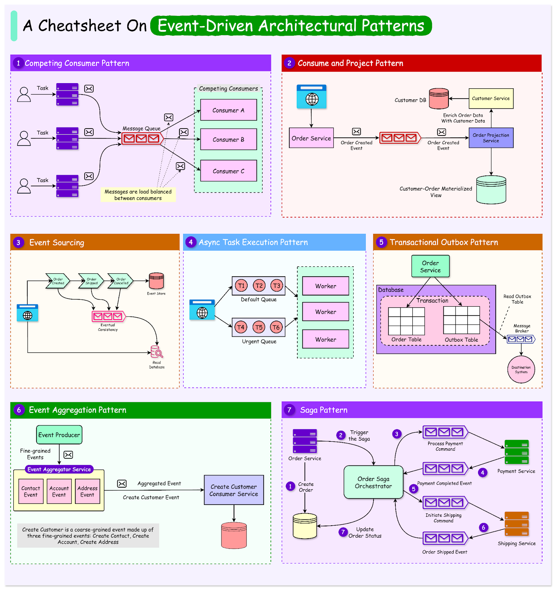
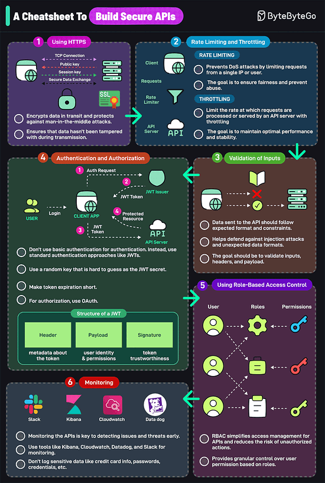

# Event-Driven Architecture Pattern
Event-Driven Architecture(EDA) is a software design approach emphasizing(nhấn mạnh) the production, detection, consumption, and reaction to events. In this architecture, events are state changes or updates within a system.
 
EDA is particularly beneficial in modern software development because it can decouple services, enhance scalability, and improve responsiveness.
 
By allowing systems to reacts asynchronously, EDA supports real-time processing and enables systems to handle high volumes of data efficiently. This approach is useful in distributed systems and microservices architectures, where different components must operate independently yet cohesively.
 
The importance of EDA in today's software landscape cannot be overstated. It offers significant advantages such as:
- Improved fault tolerance because systems can continue operating even if some components fail.
- Better resource utilzation by enabling services to scale independently based on demand.
- Supports dynamic and flexible workflows, allowing businesses to adapt quickly to changing requirements and market conditions.

In this article, we'll explore various patterns used in event-driven architecture. By examming these patterns, the aim is to gather insight into how they can be applied to build robust, scalable, and responsive systems.

# A Cheatsheet to build Secure APIs

An insecure API can compromise your entire application. Follow these strategies to mitigate the rick:
1. Using Https
Encrypts data in transit and protects against main-in-the middle attacks. This ensures that data hasn't been tampered with during transmission.
2. Rate Limiting and Throttling
Rate limiting prevents DoS attacks by limiting requests from a single IP or User. The goal is to ensure fairness and prevent abuse.
3. Validation of Inputs
Defends against injection attacks and unexpected data format. Validate headers, inputs ad payload
4. Authentication and Authorization
Don't use basic auth for authentication. Instead, use a standard authentication approach like JWTs. Use a random key that is hard to guess as the JWT secret amke token exporation short. For authorization, use OAuth.
5. Using Role-based Access Control
RBAC simplifies access management for APIs and reduces the risk of unauthorized actions.
Granular control over user permission based on roles.
6. Monitoring 
Monitoring the APIs is the key to detecting issues and threats early. Use tools kike Kinaba, Cloudwatch, Datalog, and Slack for monitoring Don't log sensitive data like credit card infor, passwords, credentials, etc.
