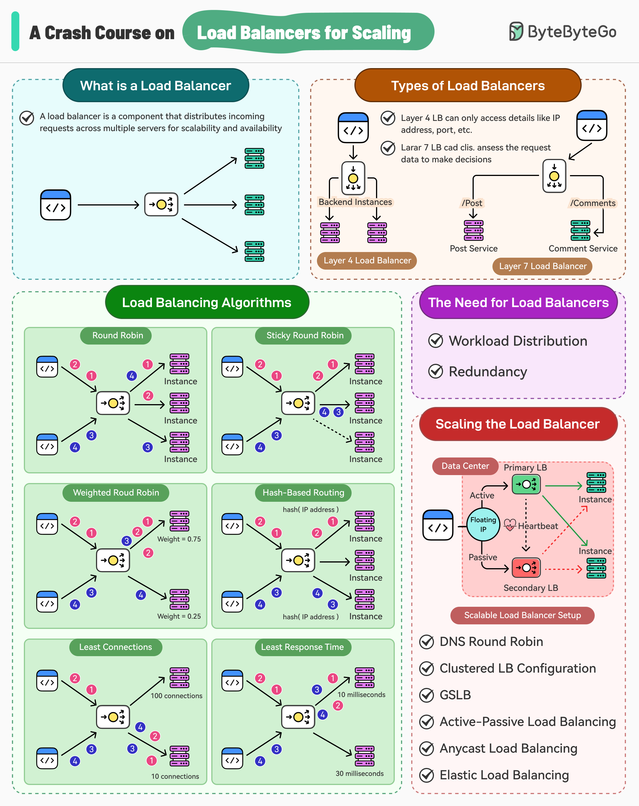

# A Crash Course on Load  Balancers for scaling
Over the years, load balancers have become a crucial component of system architecture, acting as the front-line gatekeeper that distribute incoming network traffic across multiple servers.
 
Much like a hotel receptionist who greets guests, check their documents, and directs them to specific rooms, load balancers manage the data flow within a system to ensure that the system is horizontally scalable
 s
By effectively distributing the workload across multiple servers, load balancers help maintain system performance, even during peak usage.

