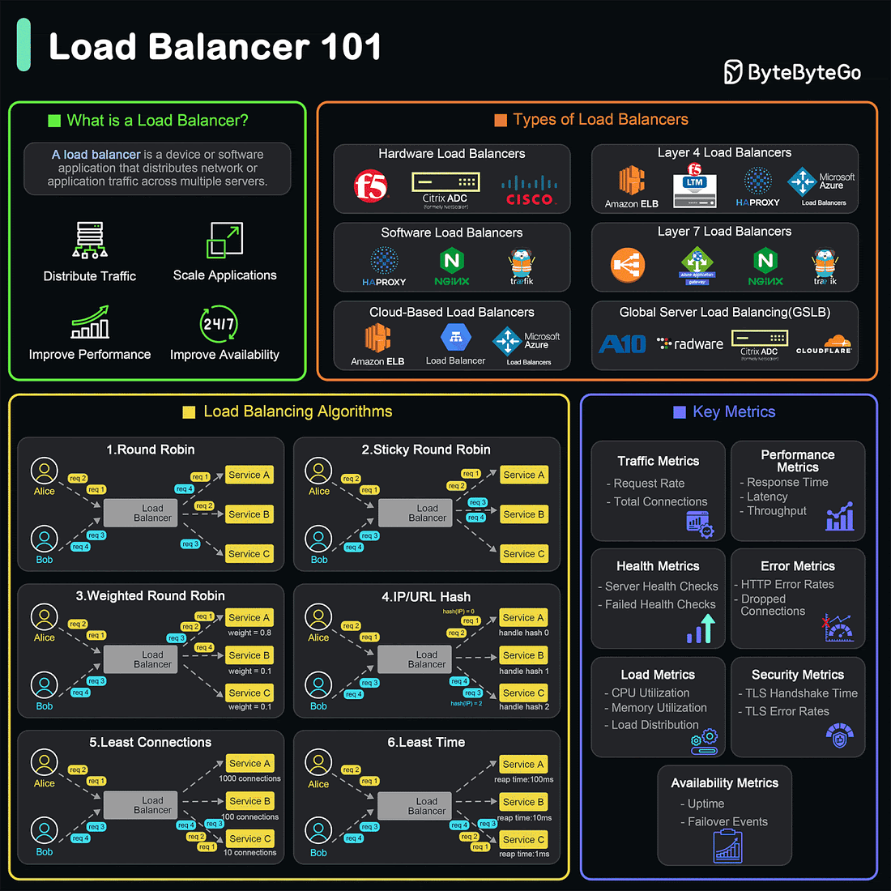

# What is a load balancer?
A load balancer is a device or softwware application that distributes network or application traffic across multple servers.

1. What does a load balancer do ?
- Distributes traffic 
- Ensures Availability and reliability
- Improves Performance
- Scales Apllications
2. Types of load balancers
- Hardware load balancers: These are physical devices designed to distribute traffic across servers.
- Software load balancers: These are applications that can be installed on standard hardware or virtual machines.
- Cloud-based load balancers: Provided by cloud service provides, these load balancers are integrated into the cloud infrastructure. Examples include AWS Elastic load balancer, Google cloud load balancing. and Azure load balancer.
- Layer 4 load balancers(Transport layer): Operate at the transport layer (OSI layer 4) and make forwarding decisions based on IP address and TCP/UDP ports.
- Layer 7 load balancers (Application layer): Operate at the application layer (OSI layer 7).
- Global server load balancing(GSLB): Distributes traffic across multiple geographical locations to improve redundancy and performance on a global scale.
# Top 10 K8s Design Patterns

1. Foundational Patterns
These patterns are the fundamental principles for application to be automated on k8s, regardless of the application's nature.
- Health probe pattern
This pattern requires that every container must implement observable APIs for the platform to manage the application
- Predictable Demands Pattern 
This pattern requires that we should declare application requirements and runtime dependencies. Every container should declare íts résources profiles.
- Automated Placement Pattern
This pattern describle the principles of Kuberneté' schedulong algorithm.
2. Structural Patterns
- Init Container Pattern 
This pattern has a separate life cycle of initalization-related tasks.
- Sidecar Pattern
This pattern extends a container's functionalities without changing it.
3. Behavioral Patterns
These patterns describle the life cycle management of a Pod. Depending on the type of the workload, it can run as a service or a batch job.
- Batch job pattern
This pattern is used to manage isolated atomic units of work.
- Stateful Service Pattern
This pattern creates distributed statefull applications.
- Service discovery parttern
This pattern describes  how clients discover the services.
4. Higher-Level Patterns
These patterns focus on higher-level application management.
- Controller pattern
This pattern monitors the current state and reconciles with the declared target state.
- Operator pattern
This pattern defines operational knowledge in a algorithmic and automated form.
Reference: developers.redhat. com/blog/2020/05/11/top-10-must-know-kubernetes-design-patterns
