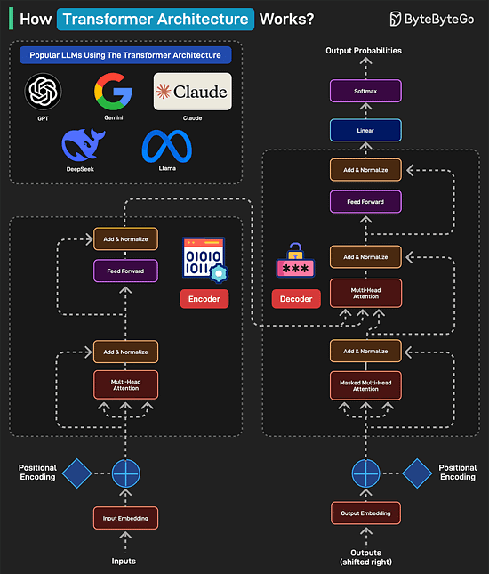

# The Data Engineering Roadmap
Data engineering has become the backbone of effective data analysis. It involves managing, processing, and optimizing data to derive actionable insights.

Here's a roadmap that can help you get better at data engineering:
1. Programming Languages
Learn SQL and a few programming languages like Python, Java, and Scala.
2. Processing Techniques
Learn batch processing tools like Spark and Hadoop and stream processing tools like Flink and Kafka.
3. Databases
Focus on both relational and non-relational databases. Some examples are MySQL, Postgres, MongoDB, Cassandra, and Redis.
4. Messaging Plaforms
Master the use of plaforms like Kafka, RabbitMQ, and Pulsar.
5. Data Lakes and Warehouses.
Learn about various data lake and warehousing solutions such as Snowflake, Hive, S3, Redshift, and Clickhouse. Also learn about Normalization, Denormalization, and OLTP vs OLAP.
6. Cloud Computing Platforms
Master the use of cloud plaforms like AWS, Azure, Docker, and K8S.
7. Storage Systems
Learn about the key storage systems like S3, Azure Data Lake, and HDFS
8. Orchestration Tools.
Learn about orchestration tools like Airflow, Jenkins, and Luigi.
9. Automation and Deployments
Learn automation tools such as Jenkins, Github Actions, and Terraform.
10. Frontend and Dashboarding
Master the use of tools like Jupyter Notebooks, PowerBI, Tableau, and Plotty.
# What is the difference between Process and Thread?

To better understand this question, let’s first take a look at what is a Program. A Program is an executable file containing a set of instructions and passively stored on disk. One program can have multiple processes. For example, the Chrome browser creates a different process for every single tab.

A Process means a program is in execution. When a program is loaded into the memory and becomes active, the program becomes a process. The process requires some essential resources such as registers, program counter, and stack.

A Thread is the smallest unit of execution within a process.

The following process explains the relationship between program, process, and thread.

1. The program contains a set of instructions.

2. The program is loaded into memory. It becomes one or more running processes.

3. When a process starts, it is assigned memory and resources. A process can have one or more threads. For example, in the Microsoft Word app, a thread might be responsible for spelling checking and the other thread for inserting text into the doc.

Main differences between process and thread:

- Processes are usually independent, while threads exist as subsets of a process.
- Each process has its own memory space. Threads that belong to the same process share the same memory.
- A process is a heavyweight operation. It takes more time to create and terminate.
- Context switching is more expensive between processes.
- Inter-thread communication is faster for threads.
# Some programming languages support coroutine. What is the difference between coroutine and thread?
Coroutines and threads are both used to achieve concurrent execution, but they have key differences in how they operate and are managed:
1. Nature of Execution
- Thread:
A thread is an independent path of execution within a process. It is managed by the operating system and may run in true parallelism on multi-core processors.
- Coroutine
A coroutine is a function that can pause execution (yield) and resume later. It is cooperative—control is explicitly given up by the coroutine, not preempted by the system.
2. Scheduling
- Thread:
Scheduled and managed by the OS (preemptive multitasking). The system can interrupt a thread at almost any time.
- Coroutine:
Scheduled in user space (cooperative multitasking). They yield control explicitly, giving more predictable behavior.
3. Resource Usage
- Thread:
Requires more memory (e.g., ~1MB stack size per thread) and has higher overhead due to OS context switching.
- Coroutine:
Lightweight; consumes less memory and has minimal overhead because context switching is done in user space.
4. Use Case
- Thread:
Best for CPU-bound or multi-core parallel tasks.
- Coroutine:
Best for I/O-bound tasks or asynchronous programming (e.g., web servers, networking, UI tasks).
5. Concurrency vs. Parallelism
- Thread:
Can achieve true parallelism on multi-core systems.
- Coroutine:
Enables concurrency but not true parallelism by itself (unless combined with threads or async frameworks).
7. 🧵 Languages with Coroutine Support

| Language       | Coroutine Support                               | Notes                                                                |
| -------------- | ----------------------------------------------- | -------------------------------------------------------------------- |
| **Python**     | `async def`, `await`, `asyncio`                 | Native coroutines since Python 3.5; great for I/O-bound async tasks. |
| **Kotlin**     | `suspend` functions + coroutines lib            | Very elegant coroutine support; ideal for Android or server code.    |
| **JavaScript** | `async` / `await`                               | Built on top of Promises; common in browser and Node.js apps.        |
| **C#**         | `async` / `await`                               | Integrated deeply into the .NET async programming model.             |
| **Lua**        | `coroutine.create`, `coroutine.yield`           | One of the first mainstream languages to support coroutines.         |
| **Go**         | `go` keyword (goroutines)                       | Not technically coroutines, but similar lightweight concurrency.     |
| **Rust**       | `async` / `.await`, with `tokio` or `async-std` | Stable coroutine-like async via `Future` trait.                      |
| **C++20**      | `co_await`, `co_yield`, `co_return`             | Introduced native coroutine support with C++20.                      |
| **Swift**      | `async` / `await`                               | Added in Swift 5.5 for structured concurrency.                       |

# What do version numbers mean?
Semantic Versioning (SemVer) is a versioning scheme for software that aims to convey meaning about the underlying changes in a release.

- SemVer uses a three-part version number: MAJOR.MINOR.PATCH.

MAJOR version: Incremented when there are incompatible API changes.

MINOR version: Incremented when functionality is added in a backward-compatible manner.

PATCH version: Incremented when backward-compatible bug fixes are made.

- Example Workflow

1. Initial Development Phase
Start with version 0.1.0.

2. First Stable Release
Reach a stable release: 1.0.0.

3. Subsequent Changes
Patch Release: A bug fix is needed for 1.0.0. Update to 1.0.1.

Minor Release: A new, backward-compatible feature is added to 1.0.3. Update to 1.1.0.

Major Release: A significant change that is not backward-compatible is introduced in 1.2.2. Update to 2.0.0.

4. Special Versions and Pre-releases
Pre-release Versions: 1.0.0-alpha, 1.0.0-beta, 1.0.0-rc.1.
Build Metadata: 1.0.0+20130313144700.

# How Transformers Architecture Works?
Transformers Architecture has become the foundation of some of the most popular LLMs including GPT, Gemini, Claude, DeepSeek, and Llama.

1. A typical transformer-based model has two main parts: encoder and decoder. The encoder reads and understands the input. The decoder uses this understanding to generate the correct output.

2. In the first step (Input Embedding), each word is converted into a number (vector) representing its meaning.

3. Next, a pattern called Positional Encoding tells the model where each word is in the sentence. This is because the word order matters in a sentence. For example “the cat ate the fish” is different from “the fish ate the cat”.

4. Next is the Multi-Head Attention, which is the brain of the encoder. It allows the model to look at all words at once and determine which words are related. In the Add & Normalize phase, the model adds what it learned from attention back into the sentence.

5. The Feed Forward process adds extra depth to the understanding. The overall process is repeated multiple times so that the model can deeply understand the sentence.

6. After the encoder finishes, the decoder kicks into action. The output embedding converts each word in the expected output into numbers. To understand where each word should go, we add Positional Encoding.

7. The Masked Multi-Head Attention hides the future words so the model predicts only one word at a time.

8. The Multi-Head Attention phase aligns the right parts of the input with the right parts of the output. The decoder looks at both the input sentence and the words it has generated so far.

9. The Feed Forward applies more processing to make the final word choice better. The process is repeated several times to refine the results.

10. Once the decoder has predicted numbers for each word, it passes them through a Linear Layer to prepare for output. This layer maps the decoder’s output to a large set of possible words.

11. After the Linear Layer generates scores for each word, the Softmax layer converts those scores into probabilities. The word with the highest probability is chosen as the next word.

12. Finally, a human-readable sentence is generated.

# Top YouTube Channels and Blogs for AI Learning in 2025

