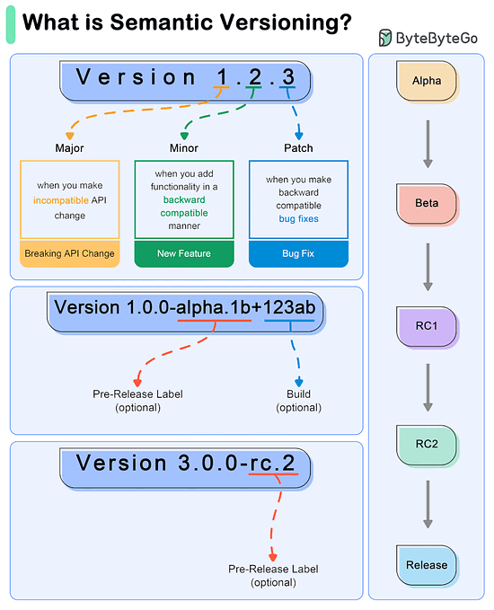
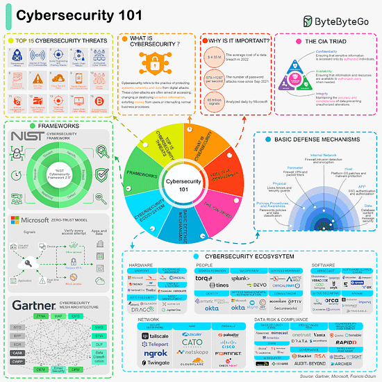
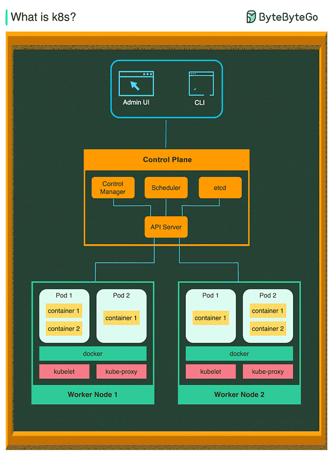

# What do version numbers mean?
Semantic Versioning (SemVer) is a versioning scheme for software tht aims to convey meaning about the underlying changes in a release

1. SemVer uses a three-part version number : MAJOR.MINOR.PATCH
- MAJOR version: Incremented when there are incompatible API changes.
- MINOR version: Incremented when functionality is added in a backward-compatible manner.
- PATCH version: Incremented when backward-compatible bug fixes are made
2. Example Workflow
- 1 - Initial Development Phase Start with version 0.1.0.
- 2 - First Stable Release Reach a stable release: 1.0.0.
- 3 - Subsequent Changes Patch Release: A bug fix is needed for 1.0.0. Update to 1.0.1.
- Minor Release: A new, backward-compatible feature is added to 1.0.3. Update to 1.1.0.
- Major Release: A significant change that is not backward-compatible is introduced in 1.2.2. Update to 2.0.0.
- 4 - Special Versions and Pre-releasesPre-release Versions: 1.0.0-alpha, 1.0.0-beta, 1.0.0-rc.1.
Build Metadata: 1.0.0+20130313144700.
# Cybersecurity 101 in one picture 

# What is k8s 
k8s is a container orchestration system. It is used for container deployment and management. Its design is greatly impacted by Google's internal system Borg.

A k8s cluster consists of a set of worker machines, called nodes, that run containerized applications. Every cluster has at least one worker node.
 
The worker node(s) host the Pods that are the components of the application workload. The control plane manages the worker nodes and the Pods in the cluster. In production environments, the control plane usually runs across multiple computers and a cluster usually runs multiple nodes, providing fault-tolerance and high availability.
- Control Plane Components
1. Api Server
The API server talks to all the components in the k8s cluster. All the operations on pods are exectuted by talking to the API server.
2. Scheduler
The scheduler watches the workloads on pods and assigns load on newly created pods.
3. Controller Manager
The controller manager runs the controller, including Node Controller, Job Controller, EndpointSlice Controller and ServiceAccount Controller.
4. etcd
etcd is a key-value store used as Kubernates' backing store for all cluster data
- Nodes
1. Pods
A pod is a group of containers and is the smallest unit that k8s administers. Pods have a signle IP address applied to every container within the pod.
2. Kubelet
An agent that runs on each node in the cluster. It ensures containers are running in a Pod.
3. Kube Proxy
Kube-proxy is a network proxy that runs on earch node in your cluster. It routes traffic coming into a node from the service. It forwards requests for work to the correct containers.