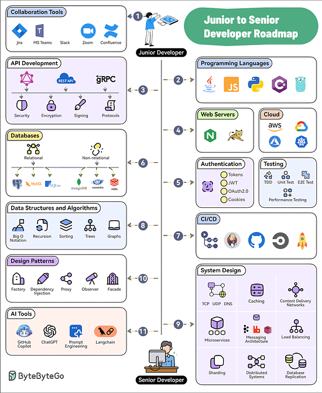
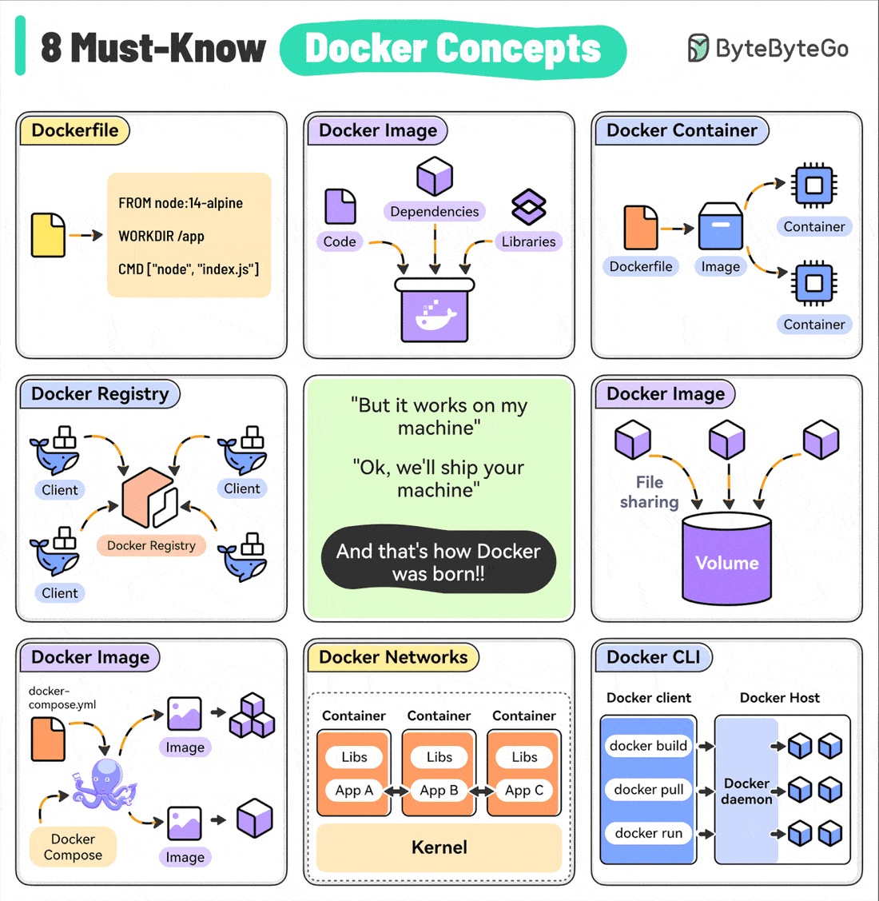
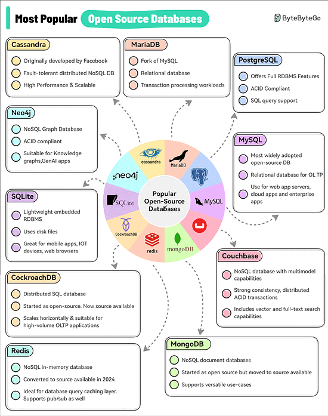

# 11 steps to go from Junior to Senior Developer

1. Collaboration Tools
Software development is a social activity. Learn to use collaboration tools like Jira, Confluence, Slack, MS Teams, Zoom, etc.
2. Programming Languagues
Pick and master one or two programming languages. Choose from options like Java, Python, JavaScript, C#, Go, etc.
3. API Development
Learn the ins and outs of API Development approaches such as REST, GraphQL, and gRPC.
4. Web Servers and Hosting 
Know about web servers as well as cloud platforms like AWS, Azure, GCP, and Kubernetes
5. Authentication and Testing
Learn how to secure your applications with authentication techniques such as JWTs, OAuth2, etc. Also, master testing techniques like TDD, E2E Testing, and Performance Testing
6. Databases
Learn to work with relational (Postgres, MySQL, and SQLite) and non-relational databases (MongoDB, Cassandra, and Redis).
7. CI/CD
Pick tools like GitHub Actions, Jenkins, or CircleCI to learn about continuous integration and continuous delivery.
8. Data Structures and Algorithms
Master the basics of DSA with topics like Big O Notation, Sorting, Trees, and Graphs.
9. System Design
Learn System Design concepts such as Networking, Caching, CDNs, Microservices, Messaging, Load Balancing, Replication, Distributed Systems, etc.
10. Design patterns
Master the application of design patterns such as dependency injection, factory, proxy, observers, and facade.
11. AI Tools
To future-proof your career, learn to leverage AI tools like GitHub Copilot, ChatGPT, Langchain, and Prompt Engineering.
# Top 8 must-know Docker concepts

1. Dockerfile: It contains the instructions to build a Docker image by sepecifying the base image, dependencies, and run command.
2. Docker Image: A lightweight, standalone package that includes everything(code, libraries, and dependencies) needed to run your application. Images are built from a Dockerfile and can be versioned.
3. Docker Container: A running instance of a Docker image. Containers are isolated from each other and the host system, providing a secure and reproducible environment for running your apps.
4. Docker Registry: A centralized repository for storing and distributing Docker images. For example, Docker Hub is the default public registry but you can also set up private registries.
5. Docker Compose: A tool for defining and running multi-container Docker applications, making it easy to manage the entire stack.
6. Docker Networks: Used to enable communication between containers and the host system. Custom networks can isolate containers or enable selective communication.
7. Docker CLI: The primary way to interact with Docker, providing commands for building images, running containers, managing volumes, and performing other operations.
# Top 10 Most Popular Open-source Databases

This list is based on factors like adoption, industry impact, and the general awareness of the database among the developer community.
1. MySQL
2. PostgreSQL
3. MariaDB
4. Apache Cassandra
5. Neo4j
6. SQLite
7. CockroachDB
8. Redis
9. MongoDB
10. Couchbase
