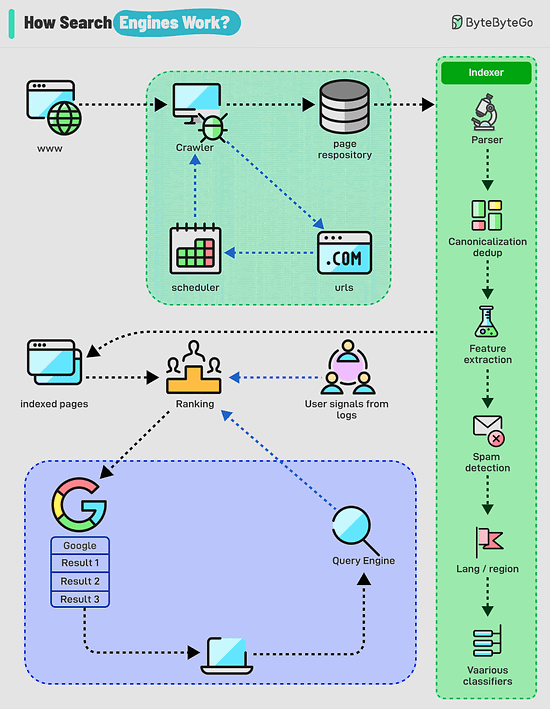

# How do airtags work?

AirTags work by leveraging a combination of Bluetooth technology the vast network of Apple devices to help you locate your lost items. Here's a breakdown of how they function:
1. Bluetooth Signal: Each airtag emits a secure Bluetooth signal that can be detected by neard by Apple devices (Iphones, iPad, etc.) within the Find My network.
2. Find My Network: When an AirTag comes within range of an Apple device in the Find My network, that device anonymously and securely relays the AirTag's location information to iCloud.
3. Location Tracking: You can then use the Find My app on your own Apple device to see the approximate location of your AirTag on a map.
Limitations:
 Please note that AirTags rely on Bluetooth technology and the presence of Apple devices within the Find My network. If your AirTag is in an area with few Apple devices, its location may not be updated as frequently or accurately.
# What is a deadlock
A deadlock occurs when two or more transactions are waiting for each other to release locks on resources they need to continue processing. This results in a situation where neither transaction can proceed, and they end up waiting indefinitely.

1. Coffman Conditions
The Coffman conditions, named after Edward G. Coffman, Jr., who first outlined them in 1971, describe four necessary conditions that must be present simultaneously for a deadlock to occur:
- Mutual Exclusion
- Hold and Wait
- No Preemption
- Circular Wait
2. Deadlock Prevention
- Resource ordering: impose a total ordering of all resource types, and require that each process requests resources in a strictly increasing order.
- Timeouts: A process that holds resources for too long can be rolled back.
- Banker’s Algorithm: A deadlock avoidance algorithm that simulates the allocation of resources to processes and helps in deciding whether it is safe to grant a resource request based on the future availability of resources, thus avoiding unsafe states.
3. Deadlock Recovery
- Selecting a victim: Most modern Database Management Systems (DBMS) and Operating Systems implement sophisticated algorithms for detecting deadlocks and selecting victims, often allowing customization of the victim selection criteria via configuration settings. The selection can be based on resource utilization, transaction priority, cost of rollback etc.
- Rollback: The database may roll back the entire transaction or just enough of it to break the deadlock. Rolled-back transactions can be restarted automatically by the database management system.
# How Do Search Engines Work?

Search engines work through a combination of three core processes:
- Crawling: Search engines use automated programs called "crawlers" to discover and download web pages from the internet. These crawlers start with a list of known web pages (seeds) and follow links on those pages to find new ones, creating a vast network of interconnected content.
- Indexing: The information collected by the crawlers is then analyzed and organized into a massive database called an index. This process involves extracting key elements such as keywords, content type, freshness, language, and other classification signals to understand what each page is about and how relevant it might be to different search queries.
- Serving search results: When a user enters a query, the search engine's algorithm sifts through the index to identify the most relevant and helpful pages. Here's a breakdown of how it works:
- Query Analysis: The search engine analyzes the user's query to understand its meaning and intent. This includes identifying keywords, recognizing synonyms, and interpreting context.
- Retrieval: The search engine retrieves relevant pages from its vast index based on the query analysis. This involves matching the query's keywords with the indexed content of web pages.
- Ranking: The retrieved pages are then ranked based on their relevance and other factors.
# 10 Essential Components of a Production Web Application

1. It all starts with CI/CD pipelines that deploy code to the server instances. Tools like Jenkins and GitHub help over here.

2. The user requests originate from the web browser. After DNS resolution, the requests reach the app servers.

3. Load balancers and reverse proxies (such as Nginx & HAProxy) distribute user requests evenly across the web application servers.

4. The requests can also be served by a Content Delivery Network (CDN).

5. The web app communicates with backend services via APIs.

6. The backend services interact with database servers or distributed caches to provide the data.

7. Resource-intensive and long-running tasks are sent to job workers using a job queue.

8. The full-text search service supports the search functionality. Tools like Elasticsearch and Apache Solr can help here.

9. Monitoring tools (such as Sentry, Grafana, and Prometheus) store logs and help analyze data to ensure everything works fine.

10. In case of issues, alerting services notify developers through platforms like Slack for quick resolution.

# A Pattern Every Modern Developer Should Know: CQRS
CQRS, which stands for Command Query Responsibility Segregation, is an architectural pattern that separates the concerns of reading and writing data. 
It divides an application into two distinct parts: 
- The Command Side: Responsible for managing create, update, and delete requests. 
- The Query Side: Responsible for handling read requests.

The CQRS pattern was first introduced by Greg Young, a software developer and architect, in 2010. He described it as a way to separate the responsibility of handling commands (write operations) from handling queries (read operations) in a system.
 
The origins of CQRS can be traced back to the Command-Query Separation (CQS) principle, introduced by Bertrand Meyer. CQS states that every method should either be a command that performs an action or a query that returns data, but not both. CQRS takes the CQS principle further by applying it at an architectural level, separating the command and query responsibilities into different models, services, or even databases.
 
Since its introduction, CQRS has gained popularity in the software development community, particularly in the context of domain-driven design (DDD) and event-driven architectures. 
 
It has been successfully applied in various domains, such as e-commerce, financial systems, and collaborative applications, where performance, scalability, and complexity are critical concerns.
 
In this post, we’ll learn about CQRS in comprehensive detail. We will cover the various aspects of the pattern along with a decision matrix on when to use it.

#   Secure QR Code Authentication Protocol

Reference: [docs.oasis-open.org](https://docs.oasis-open.org/esat/sqrap/v1.0/csd01/sqrap-v1.0-csd01.html)
1. Backend Implementation (Server-side Logic)
- Generating a QR Code
When a user opens the login page, generate a unique token (UUID) on the server and embed it into a URL. Use libraries like zxing (Java), qrcode (Node.js), or qrcode (Python). Store the generated token in a temporary data store like Redis or a database table, associated with a session or user placeholder.
- Storing Tokens
Tokens are stored temporarily and associated with the session for synchronization. Use Redis with an expiration time (e.g., 5 minutes).
- Endpoint for Mobile Validation
The mobile app will scan the QR code and send the token to a validation API.
- Notify the Browser
Use WebSocket (or long polling) to inform the browser when the token is authenticated. This ensures the user doesn’t have to refresh the page.
2. Frontend Implementation (Web Interface)
- Displaying QR Code
Use libraries like qrcode.js to generate and display the QR code.
- WebSocket Connection
The browser connects to the WebSocket and listens for updates on the token’s status.
3. Mobile App Implementation
- Integrate a QR scanner library like ZXing (Android) or AVFoundation (iOS).
4. Sending Token to the Server
Once the QR code is scanned, extract the token from the QR code and call the /validate-qr endpoint to mark it as authenticated.
## Security Considerations
- Short token expiration: Ensure tokens are valid only for a limited time.
- HTTPS only: Prevent interception of tokens.
- CSRF protection: Validate that requests originate from trusted devices.
- Rate limiting: Protect validation endpoints from brute force attacks.