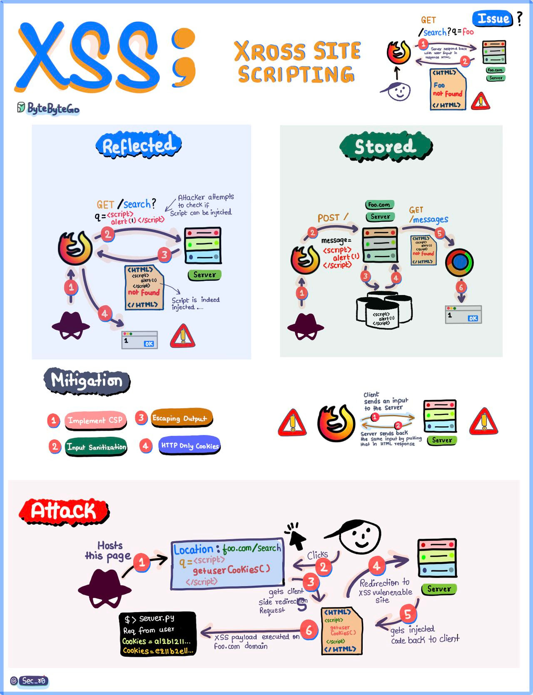

# 7 Must-know Strategies to Scale Database

1. Indexing: Check the query patterns of your application and create the right indexes
2. Materialized Views: Pre-compute complex query results and store them for faster access.
3. Denormalization: Reduce complex joins to improve query performance
4. Vertical Scaling: Boost your database server by adding more CPU, RAM, or storage.
5. Caching: Store frequently accessed data in a faster storage layer to reduce database load
6. Replication: Create replicas of your primary database on different servers for scaling the reads
7. Sharding: Split your database tables into smaller pieces and spread them across servers. Used for scaling the writes as well as the reads.
# How do we retry on failures?
In distributed systems and networked applications, retry strategies are crucial for handling transient errors and network instability effectively. 

1. Linear Backoff: Linear backoff involves waiting for a progressively increasing fixed interval between retry attempts.
- Advantages: Simple to implement and understand
- Disadvantages: May not be ideal under high load or in high-concurrency environments as it could lead to resource contention or "retry storms"
2. Linear Jitter Backoff: Linear jitter backoff modifies the linear backoff strategy by introducing randomness to the retry intervals. This strategy still increases the delay linearly but adds a random "jitter" to each interval.
- Advantages: The randomness helps spread out the retry attempts over time, reducing the chance of synchronized retries across instances.

- Disadvantages: Although better than simple linear backoff, this strategy might still lead to potential issues with synchronized retries as the base interval increases only linearly.
3. Exponential Backoff
Exponential backoff involves increasing the delay between retries exponentially. The interval might start at 1 second, then increase to 2 seconds, 4 seconds, 8 seconds, and so on, typically up to a maximum delay. This approach is more aggressive in spacing out retries than linear backoff.
- Advantages: Significantly reduces the load on the system and the likelihood of collision or overlap in retry attempts, making it suitable for high-load environments.
- Disadvantages: In situations where a quick retry might resolve the issue, this approach can unnecessarily delay the resolution.
4. Exponential Jitter Backoff
Exponential jitter backoff combines exponential backoff with randomness. After each retry, the backoff interval is exponentially increased, and then a random jitter is applied. The jitter can be either additive (adding a random amount to the exponential delay) or multiplicative (multiplying the exponential delay by a random factor).
- Advantages: Offers all the benefits of exponential backoff, with the added advantage of reducing retry collisions even further due to the introduction of jitter
- Disadvantages: The randomness can sometimes result in longer than necessary delays, especially if the jitter is significant.
# Reddit's Core Architecture

# Everything you need to know about Cross-site scripting(XSS)

XSS, a prevalent vulnerability, occurs when malicious scripts are injected into web pages, ofter throug input fields. Check out the diagram below for a deeper dive into how this vulnerability emerages when user input is improperly handled and subsequently returned to the client, leaving systems vulnerable to exploitation.
 
Understanding the distintion between Reflective and Stored XSS is crucial. Reflective XSS involves immediate execution of the injected script, while stored XSS persists over tume, posing long-term threats. Dive into the diagrams for a comprehensive comparison of these attack vectors.
 
Imagine this scenario: A cunning hacker exploits XSS to clandestinely harvest user credentials, such as cookies, from their browser, potentially leading to unauthorized access and data breaches. It's a chilling reality.
 
But fret not! Our flyer also delves into effective mitigation strategies, emprowering you to fortily your systems against XSS attacks. From input validation and output encoding to implementing strict Contect Security Policies(CSP), we've got you covered.
