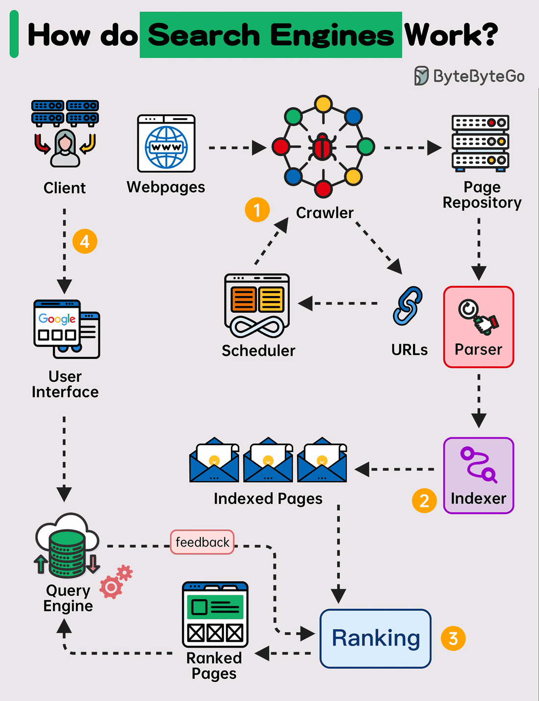
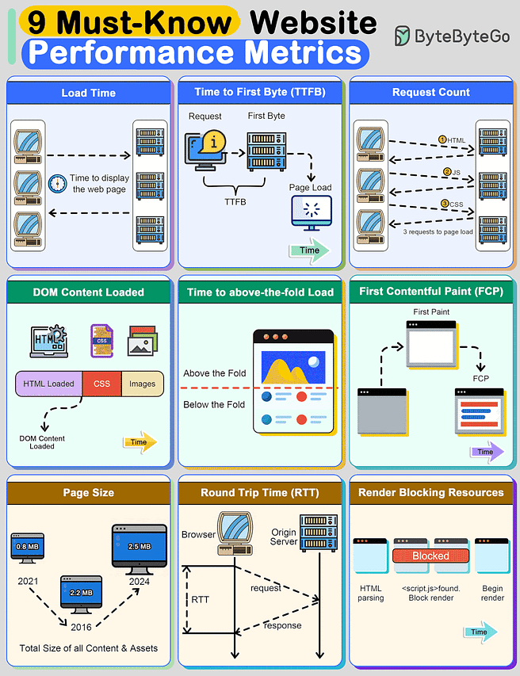
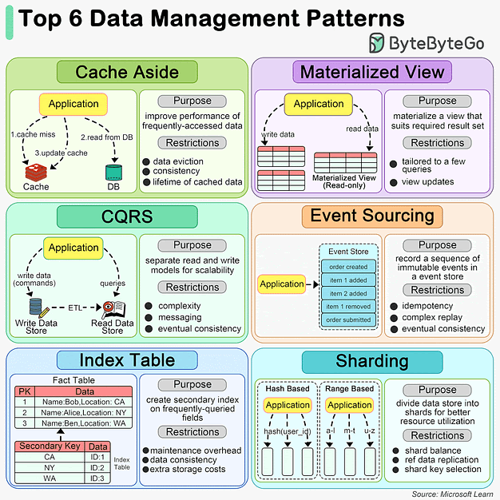

# How do search engines work
The diagram below shows a high-level walk-through of a search engine.

1. Step 1 - Crawling
Web Crawlers scan the internet for web pages. They follow the URL links from one page to another and store URLs in the URL store. The crawlers discover new content, including web pages, images, videos, and files.
2. Step 2 - Indexing
Once a web page is crawled, the search engine parses the page and indexes the content found on the page in a database. The content is analyzed and categorized(phân loại). For example, keywords, site quality, content freshness, and many other factors are assessed to understand what the page is about.
3. Step 3 - Ranking
Search engines use complex(tổ hợp) algorithms to determine(định rõ) the order of search results. These algorithms consider various(nhiều) factors, including keywords, page's relevance, content quality, user engagement, page load speed, and many others. Some search engines also personalize results based on the user's past search history, location, device, and other personal factors.
4. Step 4 - Querying 
When a user performs(biểu diễn) a search, the search engine sifts through ít index to provide the most relevent results.
# Top 9 Website Performace Metrics You Cannot Ignore

1. Load Time: This is the time taken by the web browser to download and display the webpage. It's meansured in milliseconds.
2. Time to First Byte(TTFB): It's the time taken by the browser to receive the first byte of data from the web server. TTFB is crucial because it indicates the general ability of the server to handle traffic.
3. Request count: The number of HTTP requests a browser has to make to fully load the page. The lower this count, the faster a website will feel to the user.
4. DOMContentLoaded(DCL): This is the time it takes for the full HTML code of a webpage to be loaded. The faster this happens, the fastẻ users can see userful functionality. This time doesn't include loading CSS and other assets.
5. Time to above-the-fold load: "Above the fold" is the area of a webpage that fits in a browser window without a user having to scroll down. This is the content that is first seen bt the user having to scroll down. This is first seen by the user and often dictates whether they'll continue reading the webpage.
5. Frist Contentful Paint (FCP): This is the time at which content first begins to be "painted" by the  browser. It can be a text, image, or event background color.
6. Page Size: This is the total file size of all content and assets that appear on the page. Over the last several years, the page size of websites has been growing constantly. The bigger the size of a webpage, the longer it will take to load.
7. Round Trip Time (RTT): This is the amount of time a round trip takes. A round trip constitutes a request traveling from the browser to the origin server and the response from the server going to the browser. Reducing RTT is one of the key approaches to imporoving a website's performance.
8. Reder Blocking Resouces: Some resoucers block other parts of the page from being loaded. It's important to track the number of such resources. The more render-blocking resources a webpage has, the greater the delay for browser to load page.
# How do we manage data? Here are top 6 data management patterns

1. Cache Aside(Bộ đêm sang 1 bên)
When an application needs to access data, it first checks the cache. If the data is not present (a cache miss), it fetches the data from the data store, stores it in cache, and then returns the data to the user. This pattern is particularly userful the scenarious where data is read frequently but updated less often.
2. Materialized View(Chế độ xem cụ thể hoá)
A Materialized View is a database object that contains the results of a query. It is physically stored, meaning the data is actually computed(tính toans) and stored on disk, and stored on disk, as apposed(phản đối) to being dynamically generated upon each request. This can significantly(đáng kể) speed up query times for complex calculations or aggregations that would otherwise need to be computed on the fly. Materialized views are especially benficial in data warehousing(kho bãi) and business intelligence scenarious where query performance is critical
3. CQRS 
CQRS is an architectural pattern that separates the models for reading and writing data. This means that the data structures used for querying data(reads) are separated from the structures user for updatating data(writes). This separation allows for optimization of each operation independently, improving performance, scalability, and security. CQRS can be particularly useful in complex systems where the read and write operations have very different requirements.
4. Event Sourcing 
Event Sourcing is a pattern where changes to the application state are stored as a sequence of events. Instead of storing just the current state of data in a domain, Event Sourcing stored a log of all the changes (events) that have occurred over time. This allows the application to reconstruct past states and provides an audit trail of changes. Event Sourcing is beneficial in scenarios requiring complex business transactions, auditabillity and the ability to replay events.
5. Index Table 
The index table pattern involves creating additional tables in a database that are optimized for specific query operations. These tables act as secondary indexes and are designed to speed up the retrieval of data without requiring  as full scan of primary data store. Index tables are particularly useful in scenarios with large datasets and where certain queries are performed frequently.
6. Sharding(Phân mảnh)
Sharding is a data partitioning pattern where data is divided into smaller, more manageable piecesm or "shards", each of which can be stored on different database servers. This pattern is used to distribute the data across multiple machines to improve scalability and performance. Sharding is particularly effective in high-volumne applications. as it allows for horizontal scaling, spreading the load across multiple servers to handle more users and transactions.
