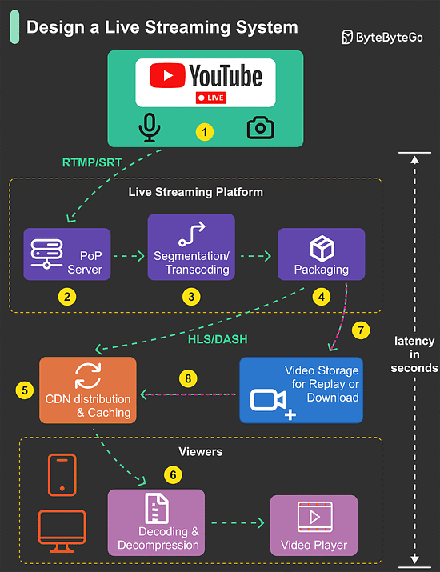
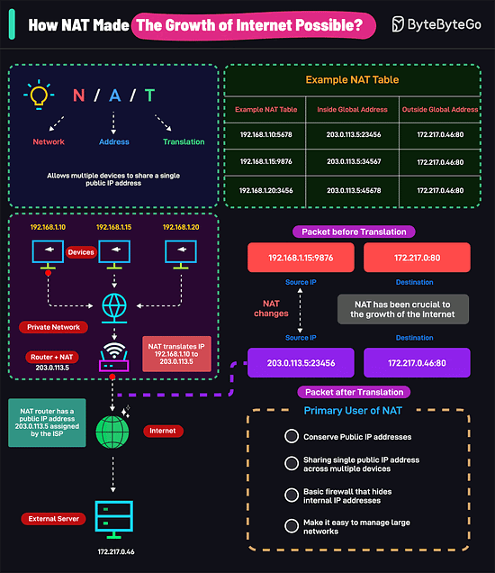
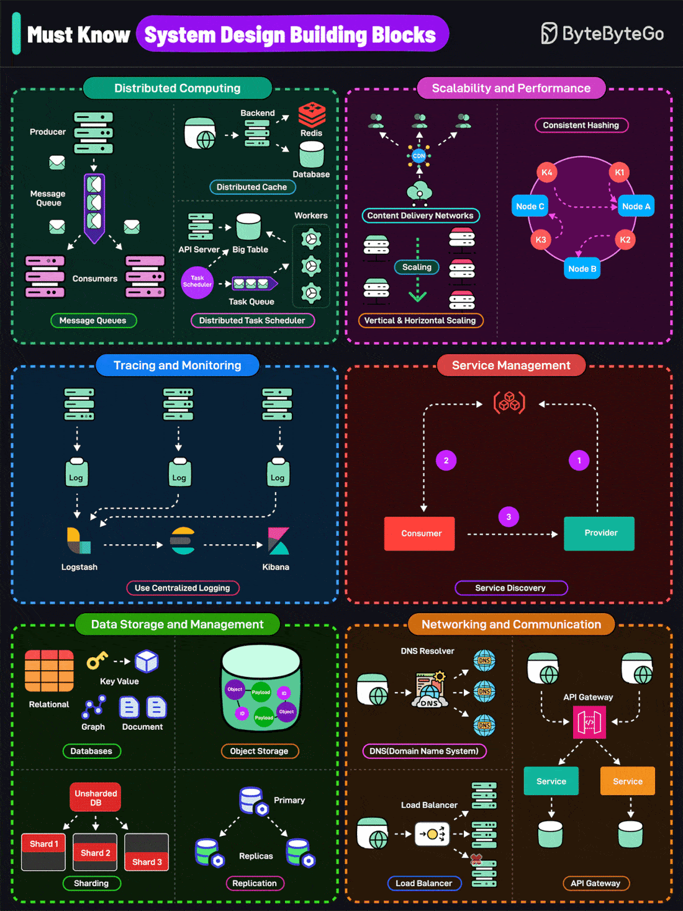

# Design a live streaming system
Live streaming is challengin because the video content is sent over the internet in near real-time. Video processing is compute-intensive. Sending a large volume of video content over the internet takes time. These factors make live streaming challenging.

- Step 1: The streamer starts their stream. The source could be any videp and audio source wired up to an encoder 
- Step 2: To provide the best upload condition for the streamer, most live streaming plaforms provide point-of-presence servers worldwide. The streamer connects to a point-of-presence server colsest to them.
- Step 3: The incoming video stream is transcoded to different resolutions, and divided into smaller video segments a few seconds in length.
- Step 4: The video segments are packaged into different live streaming formats that video players can understand. The most common live-streaming format is HLS, or HTTP Live Streaming.
- Step 5: The resulting HLS manifest and video chunks from the packaging step are cached by the CDN.
- Step 6: Finally, the video starts to arrive at the viewer’s video player.
- Step 7-8: To support replay, videos can be optionally stored in storage such as Amazon S3.
# How NAT Made the Growth of Internet Possible
Network Address Translation (NAT) is the process that has made the growth of the Internet possible.

- But how does it work?
1. In a corporate or home setting, multiple devices (phones, computers, etc.) share one router with a single public IP address.
2. When a device wants to access the internet, it sends a request to your router. The request contains the device's private IP address.
3. The router’s NAT process replaces the private IP with the router’s public IP.
4. The modified request is sent to the internet.
5. When the response comes back, NAT checks its record and replaces the public IP with the correct private IP. It sends the response to the right device.
- NAT has several important uses:
1. It helps conserve public IP addresses. Without NAT, IPv4 addresses would have been depleted much faster, severely limiting the growth of the Internet.
2. It allows sharing a single public IP address across multiple devices.
3. NAT acts as a basic firewall that hides internal IP addresses.
4. NAT also makes it easy to manage large networks.
# Must Know System Design Building Blocks

These are divided into 6 broad categories
1. Distributed Computing
Distributed message queues facilitate async communication and decouple services
Distributed caching improves performance by storing frequently accessed data in memory
A Distributed task scheduler manages and coordinates the execution of tasks
2. Scalability and Performance
Scaling services help adjust the capacity of services to handle changes in demand
CDNs serve content from geographically closer locations to improve performance and reduce latency.
Consistent hashing minimizes the remapping of keys when nodes are added or removed
3. Service Management
Service discovery enables services to find and communicate with each other without hard-coding network locations
4. Networking and Communication
DNS translates human-readable domain names into IP addresses
Load Balancer distributes incoming network traffic across multiple servers
API Gateway acts as a single entry point for a group of microservices
5. Data Storage and Management
Databases store and manage structured data
Object storage helps store complex objects like images, videos, and documents
Sharding helps horizontally partition data across multiple nodes
Replication helps horizontally scale the database by copying data to multiple nodes
6. Observability and Resiliency
Gain insights into the system's internal state through metrics, logging, and tracing.