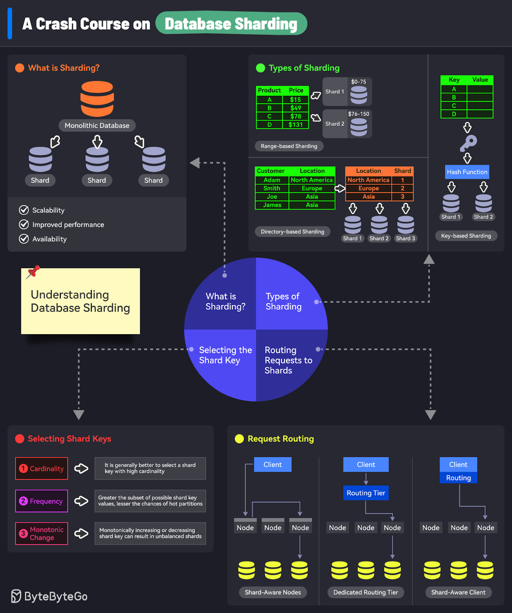
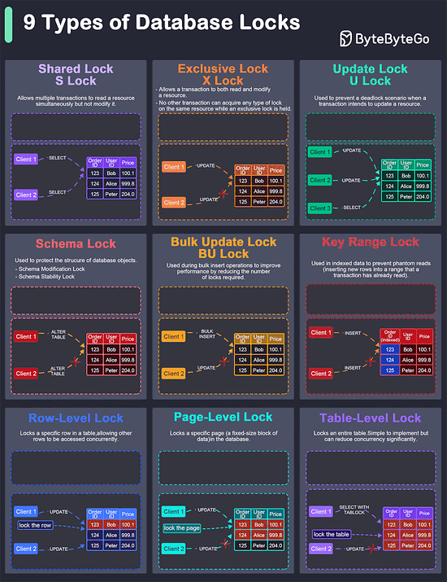
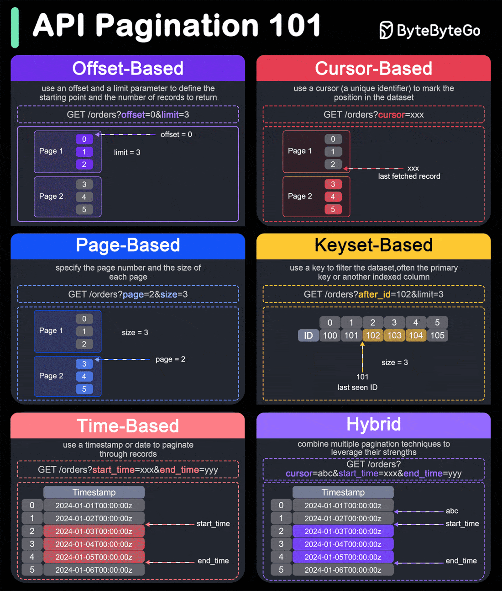

# Database Sharding
As an application grows in popularity, it attracts more active users and incorporates additional features. This growth leads to a daily increase in the database generation, which is a positive indicator from a business perspective
 
However, it can also pose challenges to the application's architecture, particularly in terms of database scalabilty.
 
The database is a critical compoment of any application, but it is also one of the most difficult components to scale horizontally. When an application receives traffic and data volume, the database can become a performance bottleneck, impacting the user experience.
 
Sharding is a technique that addresses the challenge of horizontal database scaling. It involves partitioning the database into smaller, more manageable units called shards.

# What are the differences among database locks?
In database management, locks are mechanisms that prevent concurrent access to data to ensure data integrity and consistency.

Here are the common types of locks used in database:
1. Shared lock (S lock)
It allows multiple transactions to read a resource simultaneously but not modify it. Other transactions can also acquire a shared lock on the same resource.
2. Exclusive lock (X lock)
It allows a transaction to both read and modify a resource. No other transaction can acquire any type of lock on the same resource while an exclusive lock is held.
3. Update lock (U lock)
It is used to prevent a deadlock scenario when a transaction intends to update a resource.
4. Schema Lock
It is used to protect the structure of database objects.
5. Bulk Update Lock (BU Lock)
It is used during bulk insert operations to improve performance by reducing the number of locks required.
6. Key-Range Lock
It is used in indexed data to prevent phantom reads(inserting new rows into range that a transaction has already read)
7. Row-level lock
It locks a specific row in a table, allowing other rows to be accessed concurrently.
8. Page-level lock
It locks a specific page (a fixed-size block of data) in the databases.
9. Table-level lock
It locks an entire table. This is simple to implement but can reduce concurrency significantly.
# How do we perform pagination in API Design?

Pagination is crucial in API design to handle large datasets effeciently and improve performance. Here are six popular pagination techniques:
- Offset-based pagination:
This technique uses an offset and a limit parameter to define the starting point and the number of records to return.
    - Example: GET /orders?offset=0&limit=3
    - Pros: simple to implement and understand.
    - Cons: Can become inefficient for large offsets, as it requireds scanning and skipping rows.
- Cursor-based pagination:
This technique uses a cursor(a unique identifier) to mark the position in the dataset. Typically, the cursor is an encoded string that points to a specific record.
    - Example: GET /orders?cursor=xxx
    - Pros: More efficient for large datasets, as it doesn't required scanning and skipped records.
    - Cons: Slightly more complex to implement and understand.
- Page-based pagination:
This technique specifies the page number and the size of each page.
    - Example: GET /items?page=2&size=3
    - Pros: Easy to implement and used
    - Cons: Similar performance issues as offset-based pagination for large page numbers.
- Keyset-based pagination:
This technique uses a key to filter the dataset, often the primary keu or another indexed column.
    - Example: GET /items?after_id=102&limit=3
    - Pros: Efficient for large datasets and avoids performance issues with large offsets.
    - Cons: Requires a unique and indexed key, and can be complex to implement.
- Time-based pagination:
This technique uses a timestamp or data to paginate though records.
    - Example; GET /items?start_time=xxx&end_time=yyy
    - Pros: Useful for datasets ordered by time, ensures no records are missed if new ones are added.
    - Cons: Requires a reliable and consistent timestamp.
- Hybrid Pagination:
This technique combines multiple pagination techniques to leverage their strengths.
    - Example: Combining cursor and time-based pagination for efficient scrolling throught time-ordered records.
    - Example: GET /items?cursor=abc&start_time=xxx&end_time=yyy
    - Pros: Can offer the best performance and flexibility for complex datasets.
    - Cons: More complex to implement and requires careful design.