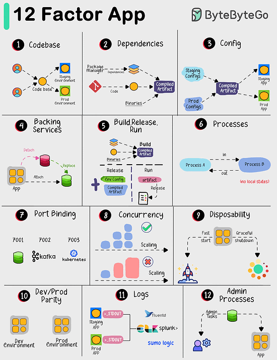

# 12 Factor App
The "12 Factor App" offers a set of best practices for building modern software applications. Following these 12 principles can help developers and teams in building reliable, scalable, and manageable applications.

1. Codebase:
Habe one place to keep all your code, and manage it using version control like Git.
2. Dependencies:
Lisr all the things your app needs to work properly, and make sure they're easy to install.
3. Config:
Keep important settings like database credentials separate from your code, so you can change them without rewriting code.
4. Backing Services:
Use other services (like databases or payment processors) as separate components that your app connects to.
5. Build, Release, Run:
Make a clear distinction between preparing your app, releasing it, and running it in production.
6. Processes:
Design your app so that each part doesn't rely on a specific computer or memory. It's like making LEGO blocks that fit together.
7. Port Binding:
Let your app be accessible through a network port, and make sure it doesn't store critical information on a single computer.
8. Concurrency:
Make your app able to handle more work by adding more copies of the same thing, like hiring more workers for a busy restaurant.
9. Disposability:
Your app should start quickly and shut down gracefully, like turning off a light switch instead of yanking out the power cord.
10. Dev/Prod Parity:
Ensure that what you use for developing your app is very similar to what you use in production, to avoid surprises.
11. Logs:
Keep a record of what happens in your app so you can understand and fix issues, like a diary for your software.
12. Admin Processes:
Run special tasks separately from your app, like doung maintenanace work in a workskhop instead of on the factory floor.
