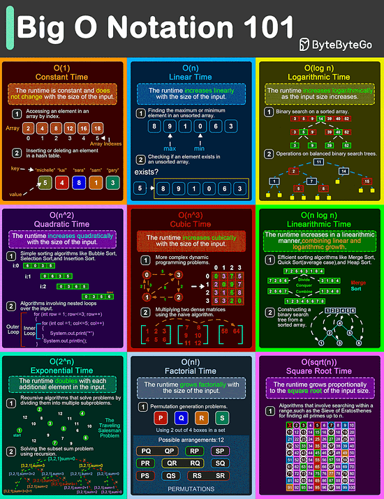

# 1. Big O Natation 101
From simple array operations to complex sorting algorithms, understanding the Big O Notation is critical for building high-performance software solutions.

1. O(1)
This is the constant time notation. The runtime remains steady regradless of input size. For example, accessing an element in an array by index and inserting/deleting an element in a hash table.
2. O(n)
Linner time notation. The runtime grows in direct proportion(tỷ lệ) to the input size. For example, finding the max or min element in an unsorted array.
3. O(log n)
Logarthmic time notation. The runtime increases slowly as the input grows. For example, a binary search on a sorted array and operations on balanced binary search trees.
4. O(n^2) 
Quadratic time notation. The runtime grows exponentially with input size. For example, simple sorting algorithms like bubble sort, insertion sort, and selection sort.
5. O(n^3)
Cubic time notation. The runtime escalates rapidly with input increases. For example, multiplying two dense matrices using the naive algorithms.
6. O(nlogn)
Linearithmic time notation. This is a blend of linear and logarithmic growth. For example, efficient sorting algorithms like merge sort, quick sort, and heap sort.
7. O(2^n)
Exponential time notation. The runtime doubles with each new input element. For example, recursive algorithms solve problems by dividing them into multiple subproblems.
8. O(n!)
Factorial time notation. Runtime skyrockets with input size. For example, permutation-generation problems.
9. O(sprt(n))
Square root time notation. Runtime increases relative to the input's square root. For example, searching within a range such as the Sieve of Eratosthenes for finding all primes up to n.
# 2. Top 4 Forms of Authentication Mechanisms

1. SSH Keys
Cryptographic keys are used to access remote systems and servers securely
2. OAuth Tokens:
Tokens that provide limited access to user data on third-party applications
3. SSL Certificates:
Digital certificates ensure secure and encrypted communication between servers and clients
4. Credentials:
User authentication information is used to verify and grant access to various systems and services.
# 3. 8 Key Concepts in DDD

1. Domain Driven Design
Domain-driven design advocates driving the design of software through domain modeling.
 
Unified language is one of the key concepts of domain-driven design. A domain model is a bridge across the business domains.
2. Business Entities
The use of models can assist in expressing concepts and knowledge and in guiding further development of software, such as databases, APIs, etc.
3. Model Boundaries 
Loose boundaries among sets of domain models are used to model business correlations.
4. Aggregation
An aggregate is a cluster of related objects(entities and value objects) that are treated as a single unit for the purpose of data changes.
5. Enitites vs. Value Objects
In addition to aggregate roots and entities, there are some models that look like disposable, they don't have their own ID to identity them, but are more as part of some entity that expresses a collection of serveral fields.
6. Operational Modeling
In domain-driven design, in order to manipulate these models, there are a number of objects that act as "operators".
7. Layering the architecture 
In order to better organize the various objects in a project, we need to simplify the complexity of complex by layering them like a computer network.
8. Build the domain model
Many methods have been invented to extract domain models from business knowledge.

# 4. Top 9 NoSQL Database Use Cases

1. MongoDB (Document Store)
Used for content management systems and catalog management.
Features BSON format, schema-less design, support horizontal scaling with sharding, and high availability with replication.
2. Cassandra(Wide-column Store)
Ideal  for time series data management and recommendation engines. Offers wide-colmn format, distributed architecture, and CQL for SQL-like queying
3. Redis(Key-Value Store)
Suited for Cache, Session Management, and Gaming Leaderboards. Provides in-memory storage, support for complex data structures, and persistence options with RDB and AOF.
4. Couchbase(Document Store with Key-Value)
Used for content management systems and e-commerce platforms. Combines key-value and document-based operations with memory-first architecture and cross-date center replication.
5. Neo4j(Graph DB)
Excellent for social networking and fraud dection. Features ACID compliance, index-free adjacency, Cypher Query Language, and HA cluster capabilities.
6. Amazon DynamoDB(Key-Value and Document)
Perfect for serverless and IoT applications. Supports both key-value and complex document data, managed by AWS, with features like partition data across nodes and DynamoDB streams.
7. Apache Hbase(Wide-Column Store)
Used for data warehouse and large-scale data processing. Modeled after Google's Bigtable, offters Hadoop integration, auto-sharding, strong consistency, and region servers.
8. Elasticsearch(Search Engine)
Ideal for full-text search and log and event data analysis. Built on Apache Lucene, document-oriented, with sharding and replication capabilities, and a RESTful interface.
9. CouchDB(Document Store)
Suitable for mobile applications and CMS. Document-oriented, ensures data consistency without locking, supports eventual consistency, and uses a RESTful API.
