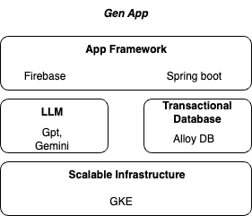
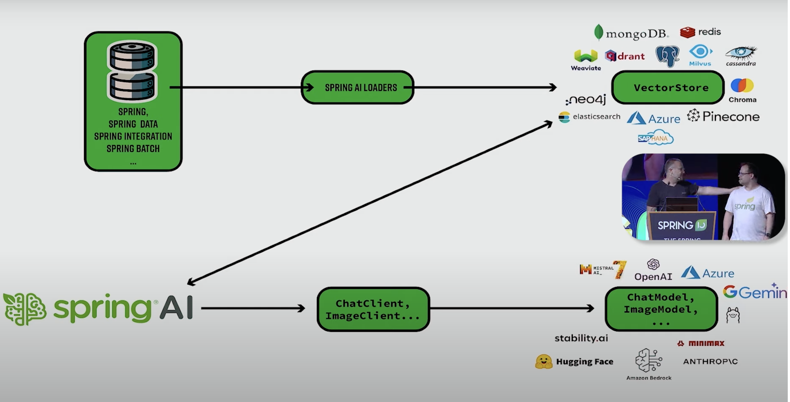

# Generative AI (Gen AI) 
Generative AI (Gen AI) refers to artificial intelligence systems designed to generate new content, such as text, images, music, or other forms of media, often by learning from and mimicking existing data. Unlike traditional AI, which primarily focuses on analyzing and interpreting data, generative AI emphasizes the creation of new data that is similar to what it was trained on.
## Key Concepts in Generative AI
1. Machine Learning Models:
- Generative Adversarial Networks (GANs): These consist of two neural networks, a generator and a discriminator, that work together to produce realistic data. The generator creates new data instances, while the discriminator evaluates them for authenticity.- 
- Variational Autoencoders (VAEs): These models encode input data into a compressed representation and then decode it back into new, similar data, allowing for the generation of new samples from the same distribution.
- Transformers: Used primarily for text generation (like GPT-3 and GPT-4), these models use attention mechanisms to handle long-range dependencies in data, enabling the generation of coherent and contextually relevant text.
2. Applications:
- Text Generation: Creating human-like text for chatbots, content creation, and translation services.
- Image Generation: Producing realistic images or artwork, enhancing photos, and generating new designs.
- Music and Audio: Composing new music tracks, generating sound effects, and creating voice samples.
- Video and Animation: Generating realistic video sequences, animations, and special effects.
3. Ethical Considerations:
- Bias and Fairness: Ensuring generated content does not perpetuate or amplify existing biases in the training data.
- Misinformation: Preventing the creation of fake news, deepfakes, and other misleading content.
- Intellectual Property: Addressing the use of copyrighted material in training generative models and the ownership of generated content.
4. Examples of Generative AI Systems
- GPT-3 and GPT-4: Developed by OpenAI, these are advanced language models capable of generating coherent and contextually appropriate text based on prompts.
- DALL-E: Another OpenAI project that generates images from textual descriptions.
- DeepArt: An application that uses AI to create artistic images by learning from existing artwork.
5. Challenges and Future Directions
- Quality and Realism: Improving the quality and realism of generated content to be indistinguishable from human-created content.
- Control and Customization: Allowing users to have more control over the output of generative models to better meet specific needs.
- Integration: Seamlessly integrating generative AI into various industries, including entertainment, education, and healthcare, to enhance productivity and creativity.
6. References Link
[The top 100 Gen Ai Consumer Apps](https://a16z.com/100-gen-ai-apps/)
## Spring AI (Integrate Spring With AI Model)
[Spring AI](https://docs.spring.io/spring-ai/reference/concepts.html)
1. Infrastructure 

2. Architecture

[Reference Link](https://www.youtube.com/watch?v=Q65-Zade25w)