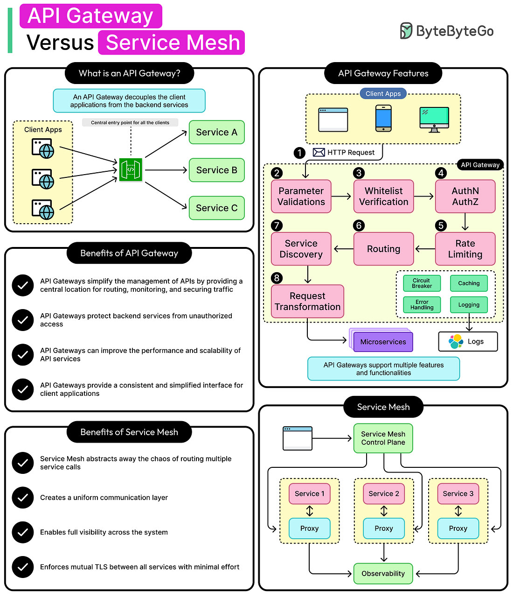
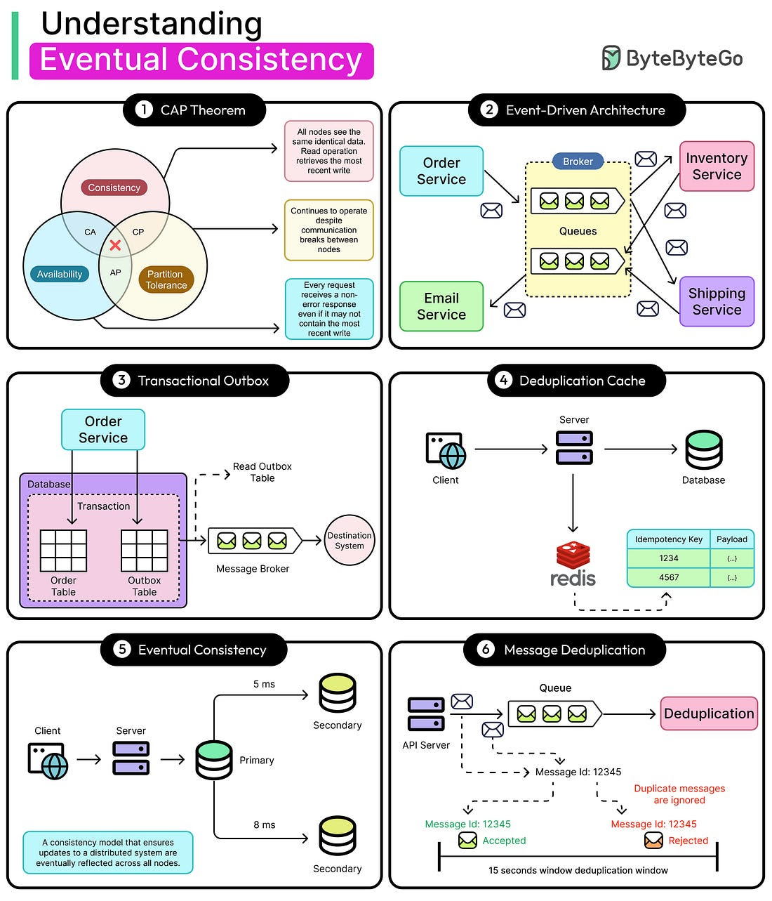
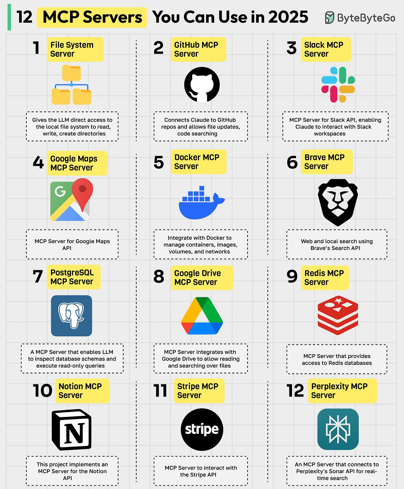
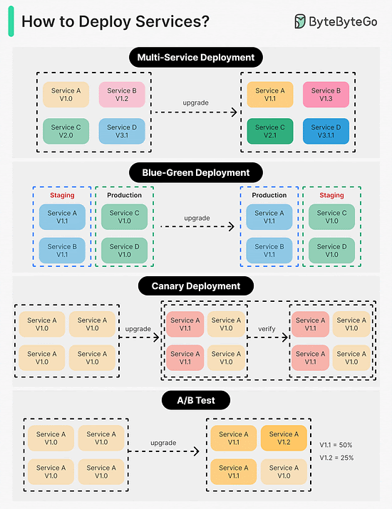
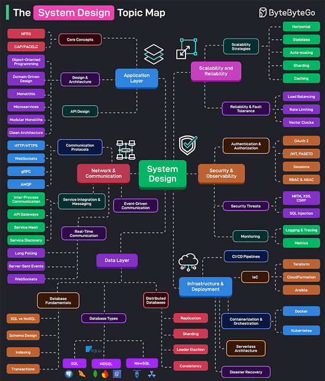
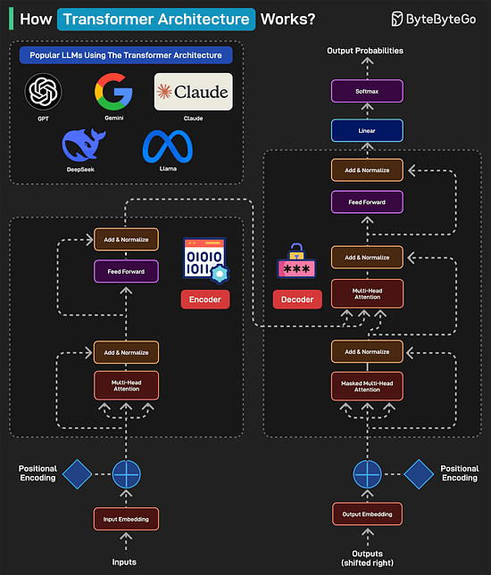

# API Gateway and Service Mesh 

# Eventual Consistency in Practice
Imagine a ride-sharing app that shows a driver’s location with a few seconds of delay. Now, imagine if the entire app refused to show anything until every backend service agreed on the perfect current location. No movement, no updates, just a spinning wheel. 

That’s what would happen if strong consistency were always preferred in a distributed system.

Modern applications (social feeds, marketplaces, logistics platforms) don’t run on a single database or monolithic backend anymore. They run on event-driven, distributed systems. Services publish and react to events. Data flows asynchronously, and components update independently. This decoupling unlocks flexibility, scalability, and resilience. However, it also means consistency is no longer immediate or guaranteed.

This is where eventual consistency becomes important.

Some examples are as follows:

A payment system might mark a transaction as pending until multiple downstream services confirm it.

A feed service might render posts while a background job deduplicates or reorders them later.

A warehouse system might temporarily oversell a product, then issue a correction as inventory updates sync across regions.

These aren’t bugs but trade-offs. 

Eventual consistency lets each component do its job independently, then reconcile later. It prioritizes availability and responsiveness over immediate agreement.

This article explores what it means to build with eventual consistency in an event-driven world. It breaks down how to deal with out-of-order events and how to design systems that can handle delays.

# API Explained

# 12 MCP Servers 

MCP (Model Context Protocol) is an open standard that simplifies how AI models, particularly LLMs, interact with external data sources, tools, and services. An MCP server acts as a bridge between these AI models and external tools. Here are the top MCP servers:
1. File System MCP Server
Allows the LLM to directly access the local file system to read, write, and create directories.
2. GitHub MCP Server
Connects Claude to GitHub repos and allows file updates, code searching.
3. Slack MCP Server
MCP Server for Slack API, enabling Claude to interact with Slack workspaces.
4. Google Maps MCP Server
MCP Server for Google Maps API.
5. Docker MCP Server
Integrate with Docker to manage containers, images, volumes, and networks.
6. Brave MCP Server
Web and local search using Brave’s Search API.
7. PostgreSQL MCP Server
An MCP server that enables LLM to inspect database schemas and execute read-only queries.
8. Google Drive MCP Server
An MCP server that integrates with Google Drive to allow reading and searching over files.
9. Redis MCP Server
MCP Server that provides access to Redis databases.
10. Notion MCP Server
This project implements an MCP server for the Notion API.
11. Stripe MCP Server
MCP Server to interact with the Stripe API.
12. Perplexity MCP Server
An MCP Server that connects to Perplexity’s Sonar API for real-time search.
# How to Deploy Services

1. Multi-Service Deployment
In this model, we deploy new changes to multiple services simultaneously. This approach is easy to implement. But since all the services are upgraded at the same time, it is hard to manage and test dependencies. It’s also hard to rollback safely.
2. Blue-Green Deployment
With blue-green deployment, we have two identical environments: one is staging (blue) and the other is production (green). The staging environment is one version ahead of production. Once testing is done in the staging environment, user traffic is switched to the staging environment, and the staging becomes the production. This deployment strategy is simple to perform rollback, but having two identical production quality environments could be expensive.
3. Canary Deployment
A canary deployment upgrades services gradually, each time to a subset of users. It is cheaper than blue-green deployment and easy to perform rollback. However, since there is no staging environment, we have to test on production. This process is more complicated because we need to monitor the canary while gradually migrating more and more users away from the old version.
4. A/B Test
In the A/B test, different versions of services run in production simultaneously. Each version runs an “experiment” for a subset of users. A/B test is a cheap method to test new features in production. We need to control the deployment process in case some features are pushed to users by accident.
# The System Design Topic Map

1. Application Layer: It consists of the core concepts such as availability, scalability, reliability, and other NFRs. Also covers design and architectural topics such as OOP, DDD, Microservices, Clean Architecture, Modular Monoliths, and so on.
2. Network & Communication: It covers communication protocols, service integration, messaging, real-time communication, and event-driven architecture.
3. Data Layer: It covers the basics of database systems (schema design, indexing, SQL vs NoSQL, transactions, etc), the various types of databases, and the nuances of distributed databases (replication, sharding, leader election, etc.)
4. Scalability & Reliability: This covers scalability strategies (horizontal, stateless, caching, partitioning, etc) and reliability strategies like load balancing, rate limiting, and so on.
5. Security & Observability: It covers authentication and authorization techniques (OAuth 2, JWT, PASETO, Sessions, Cookies, RBAC, etc.) and security threats. The observability area deals with topics like monitoring, tracing, and logging.
6. Infrastructure & Deployments: Deals with CI/CD pipelines, containerization and orchestration, serverless architecture, IaC, and disaster recovery techniques.

# How Transformers Architecture Works?
Transformers Architecture has become the foundation of some of the most popular LLMs including GPT, Gemini, Claude, DeepSeek, and Llama.

Here’s how it works:
1. A typical transformer-based model has two main parts: encoder and decoder. The encoder reads and understands the input. The decoder uses this understanding to generate the correct output.
2. In the first step (Input Embedding), each word is converted into a number (vector) representing its meaning.
3. Next, a pattern called Positional Encoding tells the model where each word is in the sentence. This is because the word order matters in a sentence. For example “the cat ate the fish” is different from “the fish ate the cat”.
4. Next is the Multi-Head Attention, which is the brain of the encoder. It allows the model to look at all words at once and determine which words are related. In the Add & Normalize phase, the model adds what it learned from attention back into the sentence.
5. The Feed Forward process adds extra depth to the understanding. The overall process is repeated multiple times so that the model can deeply understand the sentence.
6. After the encoder finishes, the decoder kicks into action. The output embedding converts each word in the expected output into numbers. To understand where each word should go, we add Positional Encoding.
7. The Masked Multi-Head Attention hides the future words so the model predicts only one word at a time.
8. The Multi-Head Attention phase aligns the right parts of the input with the right parts of the output. The decoder looks at both the input sentence and the words it has generated so far.
9. The Feed Forward applies more processing to make the final word choice better. The process is repeated several times to refine the results.
10. Once the decoder has predicted numbers for each word, it passes them through a Linear Layer to prepare for output. This layer maps the decoder’s output to a large set of possible words.
11. After the Linear Layer generates scores for each word, the Softmax layer converts those scores into probabilities. The word with the highest probability is chosen as the next word.
12. Finally, a human-readable sentence is generated.

