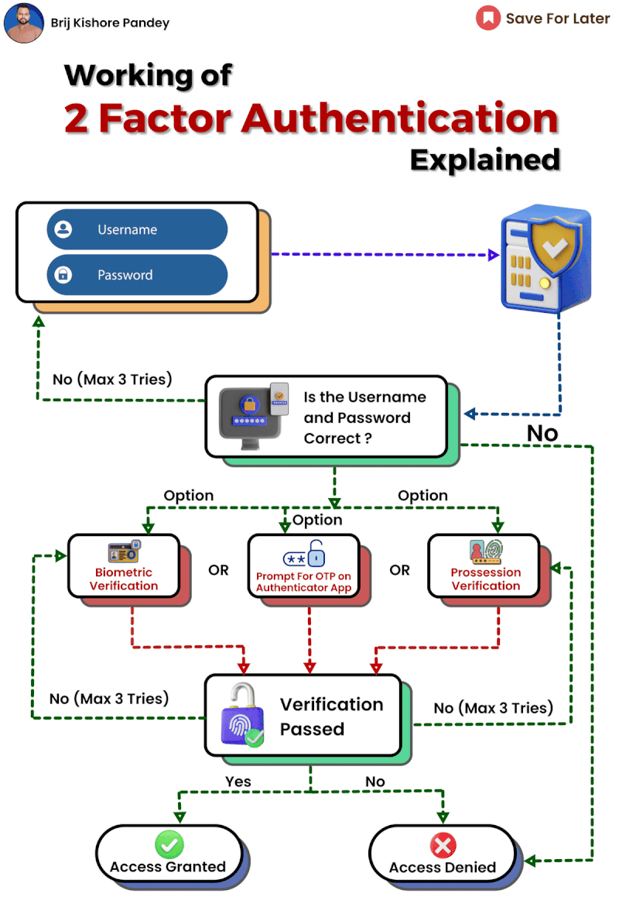

# Two-factor authentication
Two-factor authentication(2FA) is an extra layer of security used to ensure that people trying to gain access to an online account are who they say they are. First, a user will enter thier username and password. Then, instead of immediately gaining access, they will be rquired to provide another piece of information. This second factor could come from one of the following categories:
1. Something you know: This could be addtional password, a PIN, an answer to a security question, or other knowledge-based authentication.
2. Something you have: This includes items such as a smartphone, a hardware token, a security key, or a smart card. For example, a common method is to send a one-time code via SMS to the user's phone, which must then be entered along with the password.
3. Something you are: This involves biometric, such as fingerprints, facial recognition, or voice recognition.
## How 2FA Work
1. First Factor - Password: The user enters thier username and password to log in
2. Second Factor: The system then prompts for the second factor:
- SMS or Email Code: A one-time code sent to the user's registered phone number or email.
- Authenticator App: A code generated by an app like Google Authenticator or Authy
- Hardware Token: A physical device that generates a one-time code.
- Biometric: Scanning a fingerprint or using facial recognition
## Benefits of 2FA
1. Enhanced Security: Even if someone gets hold of your password, they would still need the second factor to access your account.
2. Reduced Risk of Identity Theft: Makes it harder for unauthorized users to gain access.
3. Compliance with Regulations: Many industries are required by regulations to implement multi-factor authentication.
## Type of 2FA Methods
1. SMS-based 2FA: The system sends a code via text message to the user's phone. The user then enters this code to gain access.
- Pros: Easy to use, no extra apps needed.
- Cons: Susceptible to SIM swapping and interception
2. App-based 2FA: Applications like Google Authenticator or Authy generate time-based one-time passwords(TOTPs) that the user enters after their password.
- Pros: More secure than SMS, works offline once set up
- Cons: Requires installing and setting up an app.
3. Hardware Token: Devices like YubiKey generate a one-time password or user near-field communication (NFC) to provide the second factor
- Pros: Extremely secure, phishing-resistant.
- Cons: Can be lost or damaged, costs money.
4. Biometric 2FA: Uses fingerprint, face recognition, or iris scanning.
- Pros: Very secure and convenient
- Cons: Requries compatible hardware, privacy concerns.
## Challenges and Considerations
1. User Experience: Balancing security with usability is crucial. Complicated processes may lead users to disable 2FA
2. Backup Options: Users should have backup methods in case they lose access to their primary second factor (e.g., losing a phone).
3. Cost: Implementing 2FA, especially hardware tokens or biometric systems, can be expensive.
4. Integration: Ensuring that 2FA works smoothly with existing systems and applications can be challenging.
## Future Trends in 2FA
1. Biometric Advancements: Improved accuracy and availability of biometric authentication.
2. Passwordless Authentication: Moving towards eliminating passwords entirely, relying on 2FA methods like biometrics or hardware tokens as primary authentication.
3. Adaptive Authentication: Systems that adjust the level of authentication required based on the context, such as the user’s behavior, location, and device.
# App-based 2FA
App-based two-factor authentication (2FA) is a popular method of securing online accounts by requiring a second form of authentication in addition to a password. This method relies on mobile apps, known as authenticator apps, which generate time-based one-time passwords (TOTPs) that the user must enter to complete the login process. Here's a closer look at app-based 2FA:
## How App-Based 2FA Works
1. Setup: The user install an authenticator app on their smartphone(e.g Google Authentication)
2. Linking Accounts: During the intial setup of 2FA for an account, the service provides a QR code or a secret key. The user scans the QR code or enters the secret key into the authenticator app.
3. Generating Codes: The app generates a new TOTP every 30 seconds. These codes are typical six digits long and are synchronized with the server using the TOTP algorithm.
4. Authentication: When logging in, after entering the username and password, the user is prompted to enter the current code displayed on the authenticator app.
## Benifits of App-Based 2FA
1. Security:
- Offline Operation: The app generates codes without needing an internet connection, reducing the risk of interception.
- Phishing Resistance: Codes are only valid for a short period, making it harder for attackers to use them if intercepted.
No SMS Vulnerabilities: It avoids weaknesses associated with SMS, such as SIM swapping or message interception.
2. Convenience:
- Multiple Accounts: Authenticator apps can manage multiple accounts from different services.
- Ease of Use: Scanning a QR code during setup is simple and user-friendly.
# Dive into TOTP Algorithm
The Time-based One-Time Password (TOTP) algorithm is a widely used method for generating temporary, unique codes that are used in two-factor authentication (2FA) systems. TOTP is standardized under the Internet Engineering Task Force (IETF) in RFC 6238. It builds on the HMAC-based One-Time Password (HOTP) algorithm by introducing time as a variable, making the generated passwords valid only for a short period.
## How TOTP Works
TOTP generates a one-time password based on a shared secret key and the current time. The basic components involved are:
1. Shared Secret Key: A secret key known only to the server and the client(e.g the authenticator app)
2. Current Time: The current time in UTC, divided into intervals (usually 30 seconds).
3. HMAC Algorithm: A hash-based message authentication code algorithm, typically using SHA-1, SHA-256, or SHA-512.
## Step in TOTP Algorithm
1. Generate a Time Counter: Calculate the number of time intervals that have elapsed since a reference epoch (usually January 1, 1970). This is done using the formula:
```java
T=current_time/time_step
```
where `current_time` is the current Unix time (in seconds) and `time_step` is the duration of each time interval (typically 30 seconds).
2. Create an HMAC Value: Use the shared secret key and the time counter to generate an HMAC value. This involves:
- Converting the time counter T to a binary format.
- Using the HMAC algorithm with the shared secret key and the binary time counter as inputs.
3. Truncate the HMAC Value: Extract a portion of the HMAC result to form the one-time password. This typically involves:
- Taking the last nibble (4 bits) of the HMAC value as an offset.
- Extracting 4 bytes from the HMAC value starting at the offset.
- Converting these 4 bytes to an integer and taking its modulo with 10^𝑑, where d is the desired number of digits for the one-time password (commonly 6 or 8).
## Detailed Example
Assume the shared secret key is JBSWY3DPEHPK3PXP (base32 encoded), and the current Unix time is 1609459200 seconds (January 1, 2021).
1. Generate Time Counter:
- Current Unix time: 1609459200 seconds.
- Time step: 30 seconds.
- Time counter T = 1609459200/30 =53648640
2. Create HMAC Value:
- Convert time counter to binary: 0x00003370A900.
- Use HMAC-SHA-1 with the secret key and the binary time counter.
3. Truncate HMAC Value:
- Assume the HMAC-SHA-1 result is b0344c61d8db38535ca8afceaf0bf12b881dc200.
- Offset: Last nibble of HMAC value: 0x0.
- Extract 4 bytes from the HMAC result starting at the offset 0: b0344c61.
- Convert to integer: 0xb0344c61 = 1859379137.
- Calculate the 6-digit OTP: OTP = 1859379137 mod 10^6 = 379137
Thus, the TOTP code valid for the current 30-second interval is 379137.
## Advantages of TOTP
1 .Security: TOTP codes are time-sensitive, making it difficult for attackers to reuse them.
2. Independence from Internet: Once the shared secret key is exchanged, the client does not need to be online to generate codes.
3. Standardization: Widely adopted and standardized, ensuring interoperability across different systems and applications.

Other

## Implement with Java
[twofa-java](https://github.com/hieuhoang25/two-factor-authen-java)